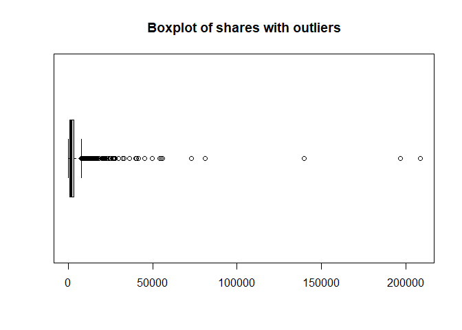
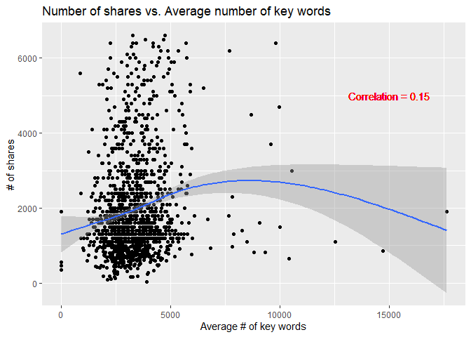
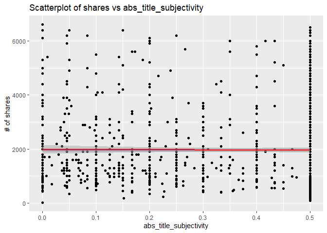

ST558 Project 2
================
Sergio Mora & Ashley Ko

  - [Introduction](#introduction)
  - [Data](#data)
  - [Summarizations](#summarizations)
  - [Modeling](#modeling)
  - [Comparison](#comparison)
  - [Automation](#automation)

# Introduction

This project summarizes and create and compares predictions for online
news popularity data sets about articles from Mashable. The goal is to
predict the number of `shares` for each of the six data channels
(lifestyle, entertainment, business, social media, tech, world). A
description and summary of this data set, `OnlineNewsPopularity.csv` can
be found here [Online News Popularity Data
Set](https://archive.ics.uci.edu/ml/datasets/Online+News+Popularity).

In order to achieve this goal, we first subset data based on predictors
we hypothesize to have an impact the number of shares of per article. We
choose following predictors `n_tokens_title`, `n_tokens_content`,
`num_imgs`, `num_videos`, `average_token_length`, `kw_avg_avg`,
`is_weekend`, `global_subjectivity`, `global_sentiment_polarity`,
`global_rate_negative_words`, `avg_negative_polarity`,
`abs_title_subjectivity`, `abs_title_sentiment_polarity`.

First, we selected average key words(kw\_avg\_avg), average length of
words (average\_token\_length), content (n\_tokens\_content), and title
(n\_tokens\_title) as metrics for the readability of an article. We
believe that easy to read articles might be more likely to be shared. In
tandem with readability, articles with more images(num\_imgs) and
videos(num\_videos) might be easier to consume and more likely shared.
It is possible that the number of shares is linked whether an article is
published on a weekday or weekend (is\_weekend). Generally speaking,
people have more more free time on the weekends which leads to more
screen-time and perhaps, more articles being shared. Lastly, emotionally
charged content is often compelling so we investigated the impact of the
subjectivity(global\_subjective and abs\_title\_subjectivity), sentiment
polarity(global\_sentiment\_polarity and
abs\_title\_sentiment\_polarity), and negative word rate
(global\_rate\_negative\_words).

A variety of numerical and graphic summaries have been used to display
our chosen predictors and their relationship to the number of shares for
the training data set. We generated the following numeric summaries
minimums, 1st quartiles, medians, means, 3rd quartiles, maximums,
standard deviations, IQRs, and correlations. Additionally, we used
correlation plots, box plots, rug plots, and a few others to visualize
the training. We used both linear models and ensemble methods (random
forest and boosted tree) to generate predictions.

## Libraries and Set-Up

This report uses the a `set.seed(123)` and the following libraries
`knitr`, `rmarkdown`, `caret`, `tidyvers`, `corrplot`, `tree`, and
`parallel`.

# Data

## Reading in data

We will read in our csv dataset. As instructed we will also split our
data by `data_channel_is_*`.

``` r
#Reads in csv file `OnlineNewsPopularity/OnlineNewsPopularity.csv` to produce a data frame
online_new_popularity_data <- read.csv("./OnlineNewsPopularity/OnlineNewsPopularity.csv")
```

## Subsetting the data

We will subset the data based on the category listed in our YAML header.
In this case, using data from `data_channel_is_lifestyle`. We will
remove non-predictors such as `url` and `timedelta` and selected our
desired predictors\*\* and `shares`. \*\*`n_tokens_title`,
`n_tokens_content`, `num_imgs`, `num_videos`, `average_token_length`,
`kw_avg_avg`, `is_weekend`, `global_subjectivity`,
`global_sentiment_polarity`, `global_rate_negative_words`,
`avg_negative_polarity`, `abs_title_subjectivity`,
`abs_title_sentiment_polarity`

``` r
# Subsetting our data based on the category parameter, dropping non-predictors,
# and subsetting for desired predictors and response variables
subset_data <- online_new_popularity_data %>%
  filter(!!as.name(paste0("data_channel_is_",params$category)) == 1) %>%
  select(n_tokens_title, n_tokens_content, num_imgs:average_token_length,
         kw_avg_avg, is_weekend, global_subjectivity, global_sentiment_polarity, 
         global_rate_negative_words, avg_negative_polarity, abs_title_subjectivity,
         abs_title_sentiment_polarity, shares)
```

Next, we will check for potential problematic values such as NA or
infinity. These could result in errors with later analysis. Should a
problem arise later on, this allows for a diagnostic to rule out
potential problematic values.

``` r
# Checking data for NA  or infinite values
na_or_infinite <- as.data.frame(apply(subset_data, 2, function(x) any(is.na(x) | is.infinite(x))))
colnames(na_or_infinite) <- c("NA or Infinite values")
na_or_infinite %>% kable()
```

|                                 | NA or Infinite values |
| :------------------------------ | :-------------------- |
| n\_tokens\_title                | FALSE                 |
| n\_tokens\_content              | FALSE                 |
| num\_imgs                       | FALSE                 |
| num\_videos                     | FALSE                 |
| average\_token\_length          | FALSE                 |
| kw\_avg\_avg                    | FALSE                 |
| is\_weekend                     | FALSE                 |
| global\_subjectivity            | FALSE                 |
| global\_sentiment\_polarity     | FALSE                 |
| global\_rate\_negative\_words   | FALSE                 |
| avg\_negative\_polarity         | FALSE                 |
| abs\_title\_subjectivity        | FALSE                 |
| abs\_title\_sentiment\_polarity | FALSE                 |
| shares                          | FALSE                 |

In this chunk, we will split our newly subset data frame into training
and test data sets. We will use a simple 70/30 split

``` r
# Setting up a simple 70/30 split for our already subset data
sample_size <- floor(0.7 * nrow(subset_data))
train_ind <- sample(seq_len(nrow(subset_data)), size = sample_size)

# This will be needed later on when we start modeling
training_data <- subset_data[train_ind,]
test_data <- subset_data[-train_ind,]
```

# Summarizations

## Numeric Summary

### Six Number Summary

First, let’s perform a simple six number summary of all vvariables from
the training data set. This summary includes minimum, 1st quartile,
median, mean, 3rd quartile, and maximum values. This provides a senses
of scale and range for variable values. Note: Binary response
variable`is_weekend` has as values of 0 or 1.

``` r
#Generates a six number summary from training_data
summary <- summary(training_data)
summary
```

    ##  n_tokens_title  n_tokens_content    num_imgs         num_videos    
    ##  Min.   : 3.00   Min.   :   0.0   Min.   :  0.000   Min.   : 0.000  
    ##  1st Qu.: 8.00   1st Qu.: 316.0   1st Qu.:  1.000   1st Qu.: 0.000  
    ##  Median :10.00   Median : 509.0   Median :  1.000   Median : 0.000  
    ##  Mean   : 9.73   Mean   : 631.9   Mean   :  4.941   Mean   : 0.501  
    ##  3rd Qu.:11.00   3rd Qu.: 807.0   3rd Qu.:  8.000   3rd Qu.: 0.000  
    ##  Max.   :17.00   Max.   :8474.0   Max.   :111.000   Max.   :50.000  
    ##  average_token_length   kw_avg_avg      is_weekend     global_subjectivity
    ##  Min.   :0.000        Min.   :    0   Min.   :0.0000   Min.   :0.0000     
    ##  1st Qu.:4.440        1st Qu.: 2627   1st Qu.:0.0000   1st Qu.:0.4236     
    ##  Median :4.621        Median : 3231   Median :0.0000   Median :0.4764     
    ##  Mean   :4.579        Mean   : 3402   Mean   :0.1872   Mean   :0.4720     
    ##  3rd Qu.:4.795        3rd Qu.: 3923   3rd Qu.:0.0000   3rd Qu.:0.5253     
    ##  Max.   :5.947        Max.   :20378   Max.   :1.0000   Max.   :0.8667     
    ##  global_sentiment_polarity global_rate_negative_words avg_negative_polarity
    ##  Min.   :-0.3727           Min.   :0.00000            Min.   :-1.0000      
    ##  1st Qu.: 0.1001           1st Qu.:0.01046            1st Qu.:-0.3213      
    ##  Median : 0.1491           Median :0.01552            Median :-0.2585      
    ##  Mean   : 0.1512           Mean   :0.01641            Mean   :-0.2660      
    ##  3rd Qu.: 0.2024           3rd Qu.:0.02115            3rd Qu.:-0.2024      
    ##  Max.   : 0.5800           Max.   :0.05785            Max.   : 0.0000      
    ##  abs_title_subjectivity abs_title_sentiment_polarity     shares      
    ##  Min.   :0.0000         Min.   :0.0000               Min.   :    28  
    ##  1st Qu.:0.2000         1st Qu.:0.0000               1st Qu.:  1100  
    ##  Median :0.5000         Median :0.0000               Median :  1700  
    ##  Mean   :0.3531         Mean   :0.1733               Mean   :  3870  
    ##  3rd Qu.:0.5000         3rd Qu.:0.3000               3rd Qu.:  3300  
    ##  Max.   :0.5000         Max.   :1.0000               Max.   :208300

### Standard Deviation

The previous section does not generate standard deviation for the
variable values. Standard deviation is necessary for determining the
variance of the response and predictors. It is a good diagnostic to spot
potential issues that violate assumptions necessary for models and
analysis. Here we will produce standard deviations for each variable
from `training_data.` Note: Binary response variable`is_weekend` has as
values of 0 or 1.

``` r
# Removes scientific notation for readability
options(scipen = 999)

# Generates and rounds (for simplicity) standard deviation
train_SDs <- as_tibble(lapply(training_data[, 1:14], sd))
round(train_SDs, digits = 5)
```

    ## # A tibble: 1 x 14
    ##   n_tokens_title n_tokens_content num_imgs num_videos average_token_length
    ##            <dbl>            <dbl>    <dbl>      <dbl>                <dbl>
    ## 1           1.89             571.     8.32       2.11                0.563
    ## # ... with 9 more variables: kw_avg_avg <dbl>, is_weekend <dbl>,
    ## #   global_subjectivity <dbl>, global_sentiment_polarity <dbl>,
    ## #   global_rate_negative_words <dbl>, avg_negative_polarity <dbl>,
    ## #   abs_title_subjectivity <dbl>, abs_title_sentiment_polarity <dbl>,
    ## #   shares <dbl>

``` r
# Turns scientific notation on
options(scipen = 0)
```

### IQR

Although the 1st and 3rd quartiles are identified in the six number
summary, it is helpful quantify the range between these two values or
IQR. IQR is also needed for subsequent plotting. Note: Binary response
variable`is_weekend` has as values of 0 or 1.

``` r
# Uses lapply to generate IQR for all variables in training_data
IQR<- as_tibble(lapply(training_data[, 1:14], IQR))
IQR
```

    ## # A tibble: 1 x 14
    ##   n_tokens_title n_tokens_content num_imgs num_videos average_token_length
    ##            <dbl>            <dbl>    <dbl>      <dbl>                <dbl>
    ## 1              3              491        7          0                0.355
    ## # ... with 9 more variables: kw_avg_avg <dbl>, is_weekend <dbl>,
    ## #   global_subjectivity <dbl>, global_sentiment_polarity <dbl>,
    ## #   global_rate_negative_words <dbl>, avg_negative_polarity <dbl>,
    ## #   abs_title_subjectivity <dbl>, abs_title_sentiment_polarity <dbl>,
    ## #   shares <dbl>

### Correlations

Prior to preforming any model fitting or statistical analysis, it is
essential to understand the potential correlation among predictors and
between the response and predictors. Correlation helps identify
potential collinearity and, thus, allows for better candidate model
selection. It is worth noting any absolute correlation values \> 0.5.
However, this threshold has been left to discretion of the individual.

``` r
# Creating a data frame of a single column of variable names 
variables <- as_tibble(attributes(training_data)$names) %>%
  rename(variable = "value")

# Generates correlations for all variables in training_data
corr <- cor(training_data)
correlations <- as_tibble(round(corr, 3))

# Binds the variable names to the correlation data frame
corr_mat <- bind_cols(variables, correlations)
correlation_matrix <- column_to_rownames(corr_mat, var = "variable")

correlation_matrix 
```

    ##                              n_tokens_title n_tokens_content num_imgs
    ## n_tokens_title                        1.000           -0.004   -0.008
    ## n_tokens_content                     -0.004            1.000    0.505
    ## num_imgs                             -0.008            0.505    1.000
    ## num_videos                            0.009            0.041   -0.055
    ## average_token_length                 -0.087            0.027   -0.007
    ## kw_avg_avg                            0.023            0.067    0.252
    ## is_weekend                           -0.005            0.031    0.214
    ## global_subjectivity                  -0.083            0.097    0.212
    ## global_sentiment_polarity            -0.119            0.068    0.175
    ## global_rate_negative_words            0.030            0.056   -0.030
    ## avg_negative_polarity                -0.028           -0.098   -0.098
    ## abs_title_subjectivity               -0.103           -0.025   -0.022
    ## abs_title_sentiment_polarity          0.005           -0.008    0.091
    ## shares                                0.008            0.097    0.044
    ##                              num_videos average_token_length kw_avg_avg
    ## n_tokens_title                    0.009               -0.087      0.023
    ## n_tokens_content                  0.041                0.027      0.067
    ## num_imgs                         -0.055               -0.007      0.252
    ## num_videos                        1.000               -0.008      0.088
    ## average_token_length             -0.008                1.000     -0.025
    ## kw_avg_avg                        0.088               -0.025      1.000
    ## is_weekend                        0.015               -0.020      0.158
    ## global_subjectivity               0.016                0.425      0.092
    ## global_sentiment_polarity         0.004                0.140      0.009
    ## global_rate_negative_words        0.003                0.126      0.063
    ## avg_negative_polarity            -0.016               -0.196     -0.090
    ## abs_title_subjectivity           -0.026                0.030      0.011
    ## abs_title_sentiment_polarity      0.022               -0.117      0.113
    ## shares                            0.085               -0.020      0.089
    ##                              is_weekend global_subjectivity
    ## n_tokens_title                   -0.005              -0.083
    ## n_tokens_content                  0.031               0.097
    ## num_imgs                          0.214               0.212
    ## num_videos                        0.015               0.016
    ## average_token_length             -0.020               0.425
    ## kw_avg_avg                        0.158               0.092
    ## is_weekend                        1.000               0.120
    ## global_subjectivity               0.120               1.000
    ## global_sentiment_polarity         0.108               0.396
    ## global_rate_negative_words        0.010               0.170
    ## avg_negative_polarity            -0.034              -0.349
    ## abs_title_subjectivity           -0.056              -0.040
    ## abs_title_sentiment_polarity      0.076               0.089
    ## shares                           -0.010               0.017
    ##                              global_sentiment_polarity
    ## n_tokens_title                                  -0.119
    ## n_tokens_content                                 0.068
    ## num_imgs                                         0.175
    ## num_videos                                       0.004
    ## average_token_length                             0.140
    ## kw_avg_avg                                       0.009
    ## is_weekend                                       0.108
    ## global_subjectivity                              0.396
    ## global_sentiment_polarity                        1.000
    ## global_rate_negative_words                      -0.436
    ## avg_negative_polarity                            0.203
    ## abs_title_subjectivity                          -0.079
    ## abs_title_sentiment_polarity                     0.111
    ## shares                                          -0.021
    ##                              global_rate_negative_words avg_negative_polarity
    ## n_tokens_title                                    0.030                -0.028
    ## n_tokens_content                                  0.056                -0.098
    ## num_imgs                                         -0.030                -0.098
    ## num_videos                                        0.003                -0.016
    ## average_token_length                              0.126                -0.196
    ## kw_avg_avg                                        0.063                -0.090
    ## is_weekend                                        0.010                -0.034
    ## global_subjectivity                               0.170                -0.349
    ## global_sentiment_polarity                        -0.436                 0.203
    ## global_rate_negative_words                        1.000                -0.189
    ## avg_negative_polarity                            -0.189                 1.000
    ## abs_title_subjectivity                           -0.032                -0.015
    ## abs_title_sentiment_polarity                     -0.004                -0.042
    ## shares                                            0.025                -0.043
    ##                              abs_title_subjectivity
    ## n_tokens_title                               -0.103
    ## n_tokens_content                             -0.025
    ## num_imgs                                     -0.022
    ## num_videos                                   -0.026
    ## average_token_length                          0.030
    ## kw_avg_avg                                    0.011
    ## is_weekend                                   -0.056
    ## global_subjectivity                          -0.040
    ## global_sentiment_polarity                    -0.079
    ## global_rate_negative_words                   -0.032
    ## avg_negative_polarity                        -0.015
    ## abs_title_subjectivity                        1.000
    ## abs_title_sentiment_polarity                 -0.412
    ## shares                                        0.032
    ##                              abs_title_sentiment_polarity shares
    ## n_tokens_title                                      0.005  0.008
    ## n_tokens_content                                   -0.008  0.097
    ## num_imgs                                            0.091  0.044
    ## num_videos                                          0.022  0.085
    ## average_token_length                               -0.117 -0.020
    ## kw_avg_avg                                          0.113  0.089
    ## is_weekend                                          0.076 -0.010
    ## global_subjectivity                                 0.089  0.017
    ## global_sentiment_polarity                           0.111 -0.021
    ## global_rate_negative_words                         -0.004  0.025
    ## avg_negative_polarity                              -0.042 -0.043
    ## abs_title_subjectivity                             -0.412  0.032
    ## abs_title_sentiment_polarity                        1.000 -0.003
    ## shares                                             -0.003  1.000

## Graphical summaries

We suppose that part of what makes a link shareable is how easy it is
for the content to be consumed. Smaller, bite sized information, in a
simple writing style might be easier to process and result in more
shares. We will test this out via proxy’s. We will measure shares
against average key words(kw\_avg\_avg), average length of words
(average\_token\_length), average number of words in the content
(n\_tokens\_content), and number of words in the title
(n\_tokens\_title). The idea here is to measure both the quantity of
words as well as the complexity of the content. i.e. an article with 500
“easy” words could be shared more than an article with 100 “difficult”
words.

### Improving graphical summaries - Cutlier check

To produce graphs and plots that give an accurate sense of the data, we
will search for potential. If we have any outliers we will remove them
first to get an idea of what the bulk of shares come from. We will
follow what the boxplot tells us when choosing what to remove.

``` r
# Boxplot from training_data
boxplot(training_data$shares,horizontal = TRUE, range = 2, main = "Boxplot of shares with outliers")
```

<!-- -->

``` r
boxplot(training_data$shares,horizontal = TRUE, range = 2, outline = FALSE,main = "Boxplot of shares without outliers")
```

<!-- -->

``` r
# Creates a subset of training data without outliers for #plotting purposes
IQR <- quantile(training_data$shares)[4] - quantile(subset_data$shares)[2]
upper_limit <- quantile(training_data$shares)[4] + (1.5 * IQR)
lower_limit <- quantile(training_data$shares)[2] - (1.5 * IQR)
subset_data_wo_outliers <- training_data %>% filter(shares <= upper_limit & shares >= lower_limit)
```

After we remove any potential outliers to our data our we can compare
shares our key metrics.

``` r
correlation1 <- cor(subset_data_wo_outliers$shares,subset_data_wo_outliers$kw_avg_avg)

plot1 <- ggplot(subset_data_wo_outliers, aes(y= shares,x = kw_avg_avg)) + 
  geom_point() +
  geom_smooth() +
  labs(title = "Number of shares vs. Average number of key words", y= "# of shares", x = "Average # of key words") +
  geom_text(color = "red",x=15000,y=5000,label = paste0("Correlation = ",round(correlation1,3)))

plot1
```

    ## `geom_smooth()` using method = 'gam' and formula 'y ~ s(x, bs = "cs")'

<!-- -->

We can measure the trend of shares as a function of Average number of
key words. If we see a possitive trend we can say that the more key
words in the articles the more likely it is to be shared, the opposite
can also be said. We measure the correlation to get a more precise gauge
in case the graph is not clear enough.

``` r
correlation2 <- cor(subset_data_wo_outliers$shares,subset_data_wo_outliers$average_token_length)

plot2 <- ggplot(subset_data_wo_outliers, aes(y= shares,x = average_token_length)) +
geom_density_2d() + 
  labs(title = "number of shares vs. Average length of words in content", y= "# of shares", x = "Average length of words in content") +
  geom_text(color = "red",x=5,y=3500,label = paste0("Correlation = ",round(correlation2,3)))

plot2
```

<!-- -->

With a density plot as a function of average length of words in content
we see where most of our shares come from. We can utilize this to help
explain our model down below.

``` r
correlation3 <- cor(subset_data_wo_outliers$shares,subset_data_wo_outliers$n_tokens_content)

plot3 <- ggplot(subset_data_wo_outliers, aes(y= shares,x = n_tokens_content)) +
geom_rug() +
  labs(title = "number of shares vs. number of words in content", y= "# of shares", x = "# of words in content") +
  geom_text(color = "red",x=4000,y=4000,label = paste0("Correlation = ",round(correlation3,3)))

plot3
```

<!-- -->

Using a rug graph we can measure the relationship between number of
words in content and the number of shares. The intersection between
where both rugs are highly concentrated is where how we can measure
correlation. If both rugs are concentrated near zero than we see that
the less words the more shareable the articles are or vice versa.

``` r
correlation4 <- cor(subset_data_wo_outliers$shares,subset_data_wo_outliers$n_tokens_title)

plot4 <- ggplot(subset_data_wo_outliers, aes(y= shares,x = n_tokens_title)) +
geom_col() +
  labs(title = "number of shares vs. number of words in title", y= "# of shares", x = "# of words in title") +
  geom_text(color = "red",x=15,y=600000,label = paste0("Correlation = ",round(correlation4,3)))

plot4
```

<!-- --> We see how the
`# of words in title` as distributed with respect to number of shares.
Any large skewness would be a flag for us to research further.

Here we graphically depict the correlations among the variables in the
training data.

``` r
# Note need to probably name graphs still etc...work in progress
corrplot(cor(training_data), tl.col = "black")
```

<!-- -->

In addition to the previous correlation plot, it is necessary to look at
individual scatterplots of the shares vs. predictors. Previously, we
plotted the relationship between shares and various word counts, but in
this section we will focus exclusively on the emotion predictors such as
`global_subjectivity`, `global_sentiment_polarity`,
`global_rate_negative_words`, `avg_negative_polarity`,
`abs_title_subjectivity`, and `abs_title_sentiment_polarity`.

``` r
corNoOut<- function(x) {
  var1 <- get(x, subset_data_wo_outliers)
  title <-paste0("Scatterplot of shares vs ", x)
  xlabel <- x
  g <- ggplot(subset_data_wo_outliers, aes(x = var1, y = shares)) + geom_point() +
    geom_smooth() + geom_smooth(method = lm, col = "Red") +
    labs(title = title, y= "# of shares", x = xlabel)
}
sentiment_preds <- list("global_subjectivity", "global_sentiment_polarity",
"global_rate_negative_words", "avg_negative_polarity",
"abs_title_subjectivity", "abs_title_sentiment_polarity")
lapply(sentiment_preds, corNoOut)
```

    ## [[1]]

    ## `geom_smooth()` using method = 'gam' and formula 'y ~ s(x, bs = "cs")'

    ## `geom_smooth()` using formula 'y ~ x'

<!-- -->

    ## 
    ## [[2]]

    ## `geom_smooth()` using method = 'gam' and formula 'y ~ s(x, bs = "cs")'
    ## `geom_smooth()` using formula 'y ~ x'

<!-- -->

    ## 
    ## [[3]]

    ## `geom_smooth()` using method = 'gam' and formula 'y ~ s(x, bs = "cs")'
    ## `geom_smooth()` using formula 'y ~ x'

<!-- -->

    ## 
    ## [[4]]

    ## `geom_smooth()` using method = 'gam' and formula 'y ~ s(x, bs = "cs")'
    ## `geom_smooth()` using formula 'y ~ x'

<!-- -->

    ## 
    ## [[5]]

    ## `geom_smooth()` using method = 'gam' and formula 'y ~ s(x, bs = "cs")'
    ## `geom_smooth()` using formula 'y ~ x'

<!-- -->

    ## 
    ## [[6]]

    ## `geom_smooth()` using method = 'gam' and formula 'y ~ s(x, bs = "cs")'
    ## `geom_smooth()` using formula 'y ~ x'

<!-- -->

We also believe that shares might increase based on whether the post was
created on a weekend. Perhaps, weekend posts are shared more frequently
as, generally, people have more screen time and thus are more apt to
share article. This section `shares` has been scaled and density plotted
by `is_weekend` as a factor where 0 is a weekday and 1 is a weekend day.

``` r
# Removing scientific notation for readability
options(scipen = 999)

# Coverts is_weekend into a two level factor
weekend_factor <- subset_data_wo_outliers %>%
  mutate(weekend = as.factor(is_weekend)) %>% select(weekend, shares)

# Base plot
g <- ggplot(weekend_factor, aes(x=shares)) +  xlab("Number of Shares") +
  ylab("Density")

# Filled, stacked histogram with density of shares by weekend level
g + geom_histogram(aes(y = ..density.., fill = weekend)) + 
  geom_density(adjust = 0.25, alpha = 0.5, aes(fill = weekend), position = "stack") +
  labs(title = "Density of Shares: Weekday vs. Weekend") + 
  scale_fill_discrete(name = "Weekday or Weekend?", labels = c("Weekday", "Weekend"))
```

    ## `stat_bin()` using `bins = 30`. Pick better value with `binwidth`.

<!-- -->

``` r
# Turning on scientific notation
options(scipen = 0)
```

# Modeling

## Linear Models

Fitting our linear model with our chosen variables. In this first linear
model we will investigate our suposition that readability of the title
and content increase shares.

``` r
# First linear model
lmfit1 <- lm(shares ~kw_avg_avg*average_token_length*n_tokens_content*n_tokens_title, data = training_data)
summary(lmfit1)
```

    ## 
    ## Call:
    ## lm(formula = shares ~ kw_avg_avg * average_token_length * n_tokens_content * 
    ##     n_tokens_title, data = training_data)
    ## 
    ## Residuals:
    ##    Min     1Q Median     3Q    Max 
    ## -12473  -2654  -1698   -282 202954 
    ## 
    ## Coefficients:
    ##                                                                   Estimate
    ## (Intercept)                                                     -6.425e+03
    ## kw_avg_avg                                                       2.692e+00
    ## average_token_length                                             1.336e+03
    ## n_tokens_content                                                -3.775e+01
    ## n_tokens_title                                                   1.113e+02
    ## kw_avg_avg:average_token_length                                 -4.243e-01
    ## kw_avg_avg:n_tokens_content                                      3.328e-03
    ## average_token_length:n_tokens_content                            8.218e+00
    ## kw_avg_avg:n_tokens_title                                        2.661e-02
    ## average_token_length:n_tokens_title                             -1.542e+01
    ## n_tokens_content:n_tokens_title                                  3.157e+00
    ## kw_avg_avg:average_token_length:n_tokens_content                -6.139e-04
    ## kw_avg_avg:average_token_length:n_tokens_title                  -7.446e-03
    ## kw_avg_avg:n_tokens_content:n_tokens_title                      -5.289e-04
    ## average_token_length:n_tokens_content:n_tokens_title            -6.262e-01
    ## kw_avg_avg:average_token_length:n_tokens_content:n_tokens_title  1.011e-04
    ##                                                                 Std. Error
    ## (Intercept)                                                      4.385e+04
    ## kw_avg_avg                                                       1.048e+01
    ## average_token_length                                             9.222e+03
    ## n_tokens_content                                                 1.172e+02
    ## n_tokens_title                                                   4.443e+03
    ## kw_avg_avg:average_token_length                                  2.194e+00
    ## kw_avg_avg:n_tokens_content                                      3.169e-02
    ## average_token_length:n_tokens_content                            2.591e+01
    ## kw_avg_avg:n_tokens_title                                        1.065e+00
    ## average_token_length:n_tokens_title                              9.317e+02
    ## n_tokens_content:n_tokens_title                                  1.171e+01
    ## kw_avg_avg:average_token_length:n_tokens_content                 7.044e-03
    ## kw_avg_avg:average_token_length:n_tokens_title                   2.217e-01
    ## kw_avg_avg:n_tokens_content:n_tokens_title                       3.133e-03
    ## average_token_length:n_tokens_content:n_tokens_title             2.582e+00
    ## kw_avg_avg:average_token_length:n_tokens_content:n_tokens_title  6.934e-04
    ##                                                                 t value
    ## (Intercept)                                                      -0.147
    ## kw_avg_avg                                                        0.257
    ## average_token_length                                              0.145
    ## n_tokens_content                                                 -0.322
    ## n_tokens_title                                                    0.025
    ## kw_avg_avg:average_token_length                                  -0.193
    ## kw_avg_avg:n_tokens_content                                       0.105
    ## average_token_length:n_tokens_content                             0.317
    ## kw_avg_avg:n_tokens_title                                         0.025
    ## average_token_length:n_tokens_title                              -0.017
    ## n_tokens_content:n_tokens_title                                   0.270
    ## kw_avg_avg:average_token_length:n_tokens_content                 -0.087
    ## kw_avg_avg:average_token_length:n_tokens_title                   -0.034
    ## kw_avg_avg:n_tokens_content:n_tokens_title                       -0.169
    ## average_token_length:n_tokens_content:n_tokens_title             -0.243
    ## kw_avg_avg:average_token_length:n_tokens_content:n_tokens_title   0.146
    ##                                                                 Pr(>|t|)
    ## (Intercept)                                                        0.884
    ## kw_avg_avg                                                         0.797
    ## average_token_length                                               0.885
    ## n_tokens_content                                                   0.747
    ## n_tokens_title                                                     0.980
    ## kw_avg_avg:average_token_length                                    0.847
    ## kw_avg_avg:n_tokens_content                                        0.916
    ## average_token_length:n_tokens_content                              0.751
    ## kw_avg_avg:n_tokens_title                                          0.980
    ## average_token_length:n_tokens_title                                0.987
    ## n_tokens_content:n_tokens_title                                    0.788
    ## kw_avg_avg:average_token_length:n_tokens_content                   0.931
    ## kw_avg_avg:average_token_length:n_tokens_title                     0.973
    ## kw_avg_avg:n_tokens_content:n_tokens_title                         0.866
    ## average_token_length:n_tokens_content:n_tokens_title               0.808
    ## kw_avg_avg:average_token_length:n_tokens_content:n_tokens_title    0.884
    ## 
    ## Residual standard error: 10070 on 1453 degrees of freedom
    ## Multiple R-squared:  0.02301,    Adjusted R-squared:  0.01292 
    ## F-statistic: 2.281 on 15 and 1453 DF,  p-value: 0.003433

Using the `data_source_is_lifestyle` as base data source, the following
chunk of code was run and to determine potential significant additive
and interaction terms by t tests for significance with p-values less
than or equal to 0.05. The subsequent model was selected for this
report: `lm(shares ~ n_tokens_content*num_imgs +
n_tokens_content*num_videos + n_tokens_content:average_token_length +
n_tokens_content*kw_avg_avg + n_tokens_content*global_sentiment_polarity
+ n_tokens_content*global_rate_negative_words + num_imgs*kw_avg_avg +
num_imgs*abs_title_sentiment_polarity + num_videos*average_token_length
+ num_videos*global_subjectivity + num_videos*global_sentiment_polarity
+ num_videos*global_rate_negative_words +
num_videos*abs_title_sentiment_polarity, data = training_data)`

``` r
# Generates a linear model with all main effects and interactions terms
lm_full <- lm(shares ~ .^2, data = training_data)
summary(lm_full)
```

This is the second linear model we will use as described above it was
selected by examining p-values from the summary of the a linear model
with all main effects and interaction terms.

``` r
# Generalates second linear model candidate
lmfit2 <- lm(shares ~  n_tokens_content*num_imgs + n_tokens_content*num_videos + 
                n_tokens_content:average_token_length + n_tokens_content*kw_avg_avg + 
                n_tokens_content*global_sentiment_polarity + 
                n_tokens_content*global_rate_negative_words + num_imgs*kw_avg_avg + 
                num_imgs*abs_title_sentiment_polarity + num_videos*average_token_length + 
                num_videos*global_subjectivity + num_videos*global_sentiment_polarity + 
                num_videos*global_rate_negative_words + num_videos*abs_title_sentiment_polarity,
              data = training_data)
summary(lmfit2)
```

    ## 
    ## Call:
    ## lm(formula = shares ~ n_tokens_content * num_imgs + n_tokens_content * 
    ##     num_videos + n_tokens_content:average_token_length + n_tokens_content * 
    ##     kw_avg_avg + n_tokens_content * global_sentiment_polarity + 
    ##     n_tokens_content * global_rate_negative_words + num_imgs * 
    ##     kw_avg_avg + num_imgs * abs_title_sentiment_polarity + num_videos * 
    ##     average_token_length + num_videos * global_subjectivity + 
    ##     num_videos * global_sentiment_polarity + num_videos * global_rate_negative_words + 
    ##     num_videos * abs_title_sentiment_polarity, data = training_data)
    ## 
    ## Residuals:
    ##    Min     1Q Median     3Q    Max 
    ## -22635  -2592  -1379    251 201208 
    ## 
    ## Coefficients:
    ##                                               Estimate Std. Error t value
    ## (Intercept)                                  9.610e+03  2.916e+03   3.296
    ## n_tokens_content                            -2.220e+01  8.546e+00  -2.598
    ## num_imgs                                    -2.135e+02  1.287e+02  -1.659
    ## num_videos                                  -7.651e+03  2.215e+03  -3.454
    ## kw_avg_avg                                   3.880e-01  3.550e-01   1.093
    ## global_sentiment_polarity                   -2.762e+04  6.229e+03  -4.435
    ## global_rate_negative_words                  -1.908e+05  5.988e+04  -3.187
    ## abs_title_sentiment_polarity                 1.692e+03  1.362e+03   1.242
    ## average_token_length                        -7.899e+02  6.836e+02  -1.155
    ## global_subjectivity                          4.363e+03  3.751e+03   1.163
    ## n_tokens_content:num_imgs                   -4.161e-02  1.615e-02  -2.577
    ## n_tokens_content:num_videos                  1.516e+00  3.577e-01   4.238
    ## n_tokens_content:average_token_length        2.836e+00  1.741e+00   1.629
    ## n_tokens_content:kw_avg_avg                 -6.446e-04  4.798e-04  -1.344
    ## n_tokens_content:global_sentiment_polarity   4.646e+01  1.059e+01   4.388
    ## n_tokens_content:global_rate_negative_words  3.702e+02  1.020e+02   3.629
    ## num_imgs:kw_avg_avg                          7.130e-02  2.994e-02   2.382
    ## num_imgs:abs_title_sentiment_polarity       -1.861e+02  1.367e+02  -1.362
    ## num_videos:average_token_length              1.313e+03  4.765e+02   2.755
    ## num_videos:global_subjectivity              -6.089e+03  3.044e+03  -2.000
    ## num_videos:global_sentiment_polarity         1.550e+04  3.110e+03   4.985
    ## num_videos:global_rate_negative_words        1.358e+05  3.078e+04   4.414
    ## num_videos:abs_title_sentiment_polarity     -3.079e+03  6.552e+02  -4.699
    ##                                             Pr(>|t|)    
    ## (Intercept)                                 0.001004 ** 
    ## n_tokens_content                            0.009485 ** 
    ## num_imgs                                    0.097352 .  
    ## num_videos                                  0.000569 ***
    ## kw_avg_avg                                  0.274568    
    ## global_sentiment_polarity                   9.92e-06 ***
    ## global_rate_negative_words                  0.001471 ** 
    ## abs_title_sentiment_polarity                0.214515    
    ## average_token_length                        0.248117    
    ## global_subjectivity                         0.244995    
    ## n_tokens_content:num_imgs                   0.010058 *  
    ## n_tokens_content:num_videos                 2.39e-05 ***
    ## n_tokens_content:average_token_length       0.103431    
    ## n_tokens_content:kw_avg_avg                 0.179315    
    ## n_tokens_content:global_sentiment_polarity  1.23e-05 ***
    ## n_tokens_content:global_rate_negative_words 0.000294 ***
    ## num_imgs:kw_avg_avg                         0.017364 *  
    ## num_imgs:abs_title_sentiment_polarity       0.173528    
    ## num_videos:average_token_length             0.005945 ** 
    ## num_videos:global_subjectivity              0.045688 *  
    ## num_videos:global_sentiment_polarity        6.96e-07 ***
    ## num_videos:global_rate_negative_words       1.09e-05 ***
    ## num_videos:abs_title_sentiment_polarity     2.87e-06 ***
    ## ---
    ## Signif. codes:  0 '***' 0.001 '**' 0.01 '*' 0.05 '.' 0.1 ' ' 1
    ## 
    ## Residual standard error: 9767 on 1446 degrees of freedom
    ## Multiple R-squared:  0.0854, Adjusted R-squared:  0.07148 
    ## F-statistic: 6.137 on 22 and 1446 DF,  p-value: < 2.2e-16

With a simple linear model we can test it’s goodness of fit with
\(R^2\). Since we are measuring human behavior we can be comfortable
with a low \(R^2\). However too low (although subjective) would indicate
that our hypothesis is wrong. As a rule of thumb we will say:

\[R^2 < .1 : we \space suspect \space that \space we \space cannot \space reject \space H_0 \\
  R^2 \space between \space .1 \space and \space .5 \space : \space we \space suspect \space that \space we \space would \space reject \space H_0 \space \\
  R^2 > .5 \space we \space feel \space confident \space that \space our \space variables \space are \space good \space predictors \space and \space our \space hypothesis \space is \space a \space good \space explanation.\]

## Ensemble Methods

### Random Forest

We can now fit our model above into a tree function. This will give us a
better picture of where our variables are most important in our model.

``` r
fitTree <- tree(shares ~kw_avg_avg + average_token_length + n_tokens_content + n_tokens_title, data = training_data)
plot(fitTree)
text(fitTree)
```

<!-- -->

We are able to use the tree function to see where our variables are most
important and in what order. This could change based on subject.

We can kick off a random forest model in our to see if adding this level
of complexity for our model is needed/beneficial.

``` r
#Random Forest
#Train control options for ensemble models
trCtrl <- trainControl(method = "repeatedcv", number = 5, repeats = 3)

rfFit <- train(shares ~kw_avg_avg + average_token_length + n_tokens_content + n_tokens_title, data = training_data, method = "rf",trControl=trCtrl, preProcess = c("center", "scale"),tuneGrid = data.frame(mtry = 1:4))

plot(rfFit)
```

<!-- -->

By plotting the `rfFit` we can see which `mtry` value is the best. This
might be different between subjects.

### Boosted Tree

Lastly, a boosted tree was fit using 5-fold, 3 times repeated
cross-validation with tuning parameter combinations of `n.trees` = (10,
25, 50, 100, 150, and 200), `interaction.depth` = 1:4, `shrinkage` =
0.1, and `n.minobsinnode` = 10.

``` r
#Tune Parameters for cross-validation
tuneParam <-expand.grid(n.trees = c(10, 25, 50, 100, 150, 200),
                         interaction.depth = 1:4, shrinkage = 0.1,
                         n.minobsinnode = 10)
#Cross-validation, tune parameter selection, and training of boosted tree models
boostTree <-train(shares ~ ., data = training_data, method = "gbm",
                trControl = trCtrl, preProcess = c("center","scale"),
                tuneGrid = tuneParam)
```

Here are results of the cross-validation for selecting the best model.

``` r
#Plot of RMSE by Max Tree Depth
plot(boostTree)
```

<!-- -->

``` r
#Results from model training
boostTree$results
```

    ##    shrinkage interaction.depth n.minobsinnode n.trees     RMSE    Rsquared
    ## 1        0.1                 1             10      10 9314.184 0.006675399
    ## 7        0.1                 2             10      10 9326.250 0.008708143
    ## 13       0.1                 3             10      10 9313.307 0.013211804
    ## 19       0.1                 4             10      10 9341.809 0.008903508
    ## 2        0.1                 1             10      25 9399.601 0.007283239
    ## 8        0.1                 2             10      25 9410.613 0.011630621
    ## 14       0.1                 3             10      25 9432.370 0.017201038
    ## 20       0.1                 4             10      25 9502.518 0.010234358
    ## 3        0.1                 1             10      50 9451.768 0.009962417
    ## 9        0.1                 2             10      50 9511.982 0.011574672
    ## 15       0.1                 3             10      50 9488.373 0.018698245
    ## 21       0.1                 4             10      50 9539.500 0.013203120
    ## 4        0.1                 1             10     100 9472.570 0.010399059
    ## 10       0.1                 2             10     100 9601.471 0.011599459
    ## 16       0.1                 3             10     100 9584.944 0.016464760
    ## 22       0.1                 4             10     100 9638.625 0.012982475
    ## 5        0.1                 1             10     150 9511.486 0.010188450
    ## 11       0.1                 2             10     150 9675.794 0.009764527
    ## 17       0.1                 3             10     150 9660.395 0.017377519
    ## 23       0.1                 4             10     150 9741.684 0.013249400
    ## 6        0.1                 1             10     200 9519.644 0.009792193
    ## 12       0.1                 2             10     200 9749.786 0.008528765
    ## 18       0.1                 3             10     200 9808.359 0.016024585
    ## 24       0.1                 4             10     200 9850.543 0.012967079
    ##         MAE   RMSESD RsquaredSD    MAESD
    ## 1  3574.866 4221.399 0.01108386 434.2246
    ## 7  3597.577 4217.418 0.01272067 432.9358
    ## 13 3591.647 4197.678 0.01881223 443.8152
    ## 19 3585.682 4176.453 0.01011317 404.1564
    ## 2  3588.176 4158.064 0.01004078 437.2697
    ## 8  3607.004 4152.264 0.01602844 424.2763
    ## 14 3641.356 4085.304 0.02181729 429.1372
    ## 20 3657.953 4082.510 0.01145599 422.6376
    ## 3  3616.140 4126.123 0.01383672 447.9844
    ## 9  3675.049 4093.038 0.01431167 428.1359
    ## 15 3688.605 4033.984 0.02130345 423.5607
    ## 21 3703.391 4072.646 0.01592706 440.9838
    ## 4  3624.979 4137.664 0.01434483 449.5649
    ## 10 3725.661 4066.493 0.01390977 428.0979
    ## 16 3735.526 3966.046 0.01702471 381.7412
    ## 22 3837.131 4008.699 0.01262629 445.7811
    ## 5  3642.995 4129.512 0.01327370 437.8190
    ## 11 3776.819 4111.983 0.01206035 461.2173
    ## 17 3814.385 3949.451 0.01868900 394.6577
    ## 23 3934.740 3930.264 0.01214062 387.2624
    ## 6  3648.228 4134.406 0.01296948 439.7082
    ## 12 3831.016 4081.354 0.01011915 467.9957
    ## 18 3922.796 3926.611 0.01745069 396.7291
    ## 24 4039.521 3951.242 0.01186421 433.6684

The best tuning paramters are:

``` r
#Best tuning parameters
boostTree$bestTune
```

    ##    n.trees interaction.depth shrinkage n.minobsinnode
    ## 13      10                 3       0.1             10

This section generates the predictions based on the best boosted tree
model.

``` r
#Uses best tuned training boosted tree model to predict test data
boostTreePred <-predict(boostTree, newdata = test_data)

#Reports best boosted tree model and corresponding RMSE
boost <-boostTree$results[1,]
boost
```

    ##   shrinkage interaction.depth n.minobsinnode n.trees     RMSE    Rsquared
    ## 1       0.1                 1             10      10 9314.184 0.006675399
    ##        MAE   RMSESD RsquaredSD    MAESD
    ## 1 3574.866 4221.399 0.01108386 434.2246

# Comparison

``` r
lmfit_1 = c(MAE(test_data$shares,predict(lmfit1)),RMSE(test_data$shares,predict(lmfit1)))

lmfit_2 = c(MAE(test_data$shares,predict(lmfit2)),RMSE(test_data$shares,predict(lmfit2)))

rffit_c = c(MAE(test_data$shares,predict(rfFit)),RMSE(test_data$shares,predict(rfFit)))

boostTree_c = c(MAE(test_data$shares,predict(boostTree)),RMSE(test_data$shares,predict(boostTree)))

MAE_RMSE_SUMM <- rbind.data.frame("Linear Model 1" = lmfit_1, "Linear Model 2" = lmfit_2,"Random Forrest" = rffit_c, "Boosted Tree" = boostTree_c)

colnames(MAE_RMSE_SUMM) <- c("MAE","RMSE")
rownames(MAE_RMSE_SUMM) <- c("Linear Model 1", "Linear Model 2", "Random Forrest", "Boosted Tree")
kable(MAE_RMSE_SUMM, caption = "Comparing models via MAE and RMSE")
```

|                |      MAE |     RMSE |
| :------------- | -------: | -------: |
| Linear Model 1 | 3110.422 | 4986.746 |
| Linear Model 2 | 3363.329 | 5594.405 |
| Random Forrest | 3340.404 | 6673.423 |
| Boosted Tree   | 3094.707 | 4983.017 |

Comparing models via MAE and RMSE

Measuring success with MAE and RMSE. This helps measure the models
success while also accounting for the complexity of the model. We can
use the MAE **and** RMSE to see if any issues in our data come form a
single point (or a small subset of points).

# Automation

The following code chunk was called in the console in order to generate
a report of each category of data\_channel\_is\_\* (`lifestyle`,
`entertainment`, `bus`, `socmed`, `tech`, `world`).

``` r
library(rmarkdown)
# Creates a list of the six data_channel_is_* options
category <- c("lifestyle", "entertainment", "bus", "socmed", "tech", "world")

# Creates output filenames
output_file <- paste0(category, ".html")
# Creates a list for each data channel with just the category parameter
params = lapply(category, FUN = function(x){list(category = x)})

# Stores list of file output file names and parameters as a data frame
reports <- tibble(output_file, params)

# Applies the render function to each pair of output file name and category
apply(reports, MARGIN = 1, FUN = function(x){ render(input = "Project 2.Rmd",
                                                     output_file = x[[1]],
                                                     params = x[[2]])})
```
