# Introduction
This project summarizes and create and compares predictions for online news popularity data sets about articles from Mashable. The goal is to predict the number of `shares` for each of the six data channels (lifestyle, entertainment, business, social media, tech, world). A description and summary of this data set, `OnlineNewsPopularity.csv` can be found here [Online News Popularity Data Set](https://archive.ics.uci.edu/ml/datasets/Online+News+Popularity).

In order to achieve this goal, we first subset data based on predictors we hypothesize to have an impact the number of shares of per article. We choose following predictors `n_tokens_title`, `n_tokens_content`, `num_imgs`, `num_videos`, `average_token_length`, `kw_avg_avg`, `is_weekend`, `global_subjectivity`, `global_sentiment_polarity`, `global_rate_negative_words`, `avg_negative_polarity`, `abs_title_subjectivity`, `abs_title_sentiment_polarity`.

First, we selected average key words(kw_avg_avg), average length of words (average_token_length), content (n_tokens_content), and title (n_tokens_title) as metrics for the readability of an article. We believe that easy to read articles might be more likely to be shared. In tandem with readability, articles with more images(num_imgs) and videos(num_videos) might be easier to consume and more likely shared. It is possible that the number of shares is linked whether an article is published on a weekday or weekend (is_weekend). Generally speaking, people have more more free time on the weekends which leads to more screen-time and perhaps, more articles being shared. Lastly, emotionally charged content is often compelling so we investigated the impact of the subjectivity(global_subjective and abs_title_subjectivity), sentiment polarity(global_sentiment_polarity and abs_title_sentiment_polarity), and negative word rate (global_rate_negative_words).

A variety of numerical and graphic summaries have been used to display our chosen predictors and their relationship to the number of shares for the training data set. We generated the following numeric summaries minimums, 1st quartiles, medians, means, 3rd quartiles, maximums, standard deviations, IQRs, and correlations. Additionally, we used correlation plots, box plots, rug plots, and a few others to visualize the training. We used both linear models and ensemble methods (random forest and boosted tree) to generate predictions.

## Libraries and Set-Up
This report uses the a `set.seed(123)` and the following libraries `knitr`, `rmarkdown`, `caret`, `tidyvers`, `corrplot`, `tree`, and `parallel`.

# Data

## Reading in data
We will read in our csv dataset. As instructed we will also split our data by `data_channel_is_*`.

```r
#Reads in csv file `OnlineNewsPopularity/OnlineNewsPopularity.csv` to produce a data frame
online_new_popularity_data <- read.csv("./OnlineNewsPopularity/OnlineNewsPopularity.csv")
```

## Subsetting the data
We will subset the data based on the category listed in our YAML header. In this case, using data from `data_channel_is_lifestyle`. We will remove non-predictors such as `url` and `timedelta` and selected our desired predictors** and `shares`.
**`n_tokens_title`, `n_tokens_content`, `num_imgs`, `num_videos`, `average_token_length`, `kw_avg_avg`, `is_weekend`, `global_subjectivity`, `global_sentiment_polarity`, `global_rate_negative_words`, `avg_negative_polarity`, `abs_title_subjectivity`, `abs_title_sentiment_polarity`

```r
# Subsetting our data based on the category parameter, dropping non-predictors,
# and subsetting for desired predictors and response variables
subset_data <- online_new_popularity_data %>%
  filter(!!as.name(paste0("data_channel_is_",params$category)) == 1) %>%
  select(n_tokens_title, n_tokens_content, num_imgs:average_token_length,
         kw_avg_avg, is_weekend, global_subjectivity, global_sentiment_polarity, 
         global_rate_negative_words, avg_negative_polarity, abs_title_subjectivity,
         abs_title_sentiment_polarity, shares)
```

Next, we will check for potential problematic values such as NA or infinity. These could result in errors with later analysis. Should a problem arise later on, this allows for a diagnostic to rule out potential problematic values.

```r
# Checking data for NA  or infinite values
na_or_infinite <- as.data.frame(apply(subset_data, 2, function(x) any(is.na(x) | is.infinite(x))))
colnames(na_or_infinite) <- c("NA or Infinite values")
na_or_infinite %>% kable()
```


|                             |NA or Infinite values |
|:----------------------------|:---------------------|
|n_tokens_title               |FALSE                 |
|n_tokens_content             |FALSE                 |
|num_imgs                     |FALSE                 |
|num_videos                   |FALSE                 |
|average_token_length         |FALSE                 |
|kw_avg_avg                   |FALSE                 |
|is_weekend                   |FALSE                 |
|global_subjectivity          |FALSE                 |
|global_sentiment_polarity    |FALSE                 |
|global_rate_negative_words   |FALSE                 |
|avg_negative_polarity        |FALSE                 |
|abs_title_subjectivity       |FALSE                 |
|abs_title_sentiment_polarity |FALSE                 |
|shares                       |FALSE                 |

In this chunk, we will split our newly subset data frame into training and test data sets.
We will use a simple 70/30 split

```r
# Setting up a simple 70/30 split for our already subset data
sample_size <- floor(0.7 * nrow(subset_data))
train_ind <- sample(seq_len(nrow(subset_data)), size = sample_size)

# This will be needed later on when we start modeling
training_data <- subset_data[train_ind,]
test_data <- subset_data[-train_ind,]
```

# Summarizations

## Numeric Summary

### Six Number Summary
First, let's perform a simple six number summary of all vvariables from the training data set. This summary includes minimum, 1st quartile, median, mean, 3rd quartile, and maximum values. This provides a senses of scale and range for variable values. Note: Binary response variable`is_weekend` has as values of 0 or 1. 

```r
#Generates a six number summary from training_data
summary <- summary(training_data)
summary
```

```
##  n_tokens_title  n_tokens_content    num_imgs         num_videos    
##  Min.   : 3.00   Min.   :   0.0   Min.   :  0.000   Min.   : 0.000  
##  1st Qu.: 8.00   1st Qu.: 316.0   1st Qu.:  1.000   1st Qu.: 0.000  
##  Median :10.00   Median : 509.0   Median :  1.000   Median : 0.000  
##  Mean   : 9.73   Mean   : 631.9   Mean   :  4.941   Mean   : 0.501  
##  3rd Qu.:11.00   3rd Qu.: 807.0   3rd Qu.:  8.000   3rd Qu.: 0.000  
##  Max.   :17.00   Max.   :8474.0   Max.   :111.000   Max.   :50.000  
##  average_token_length   kw_avg_avg      is_weekend     global_subjectivity
##  Min.   :0.000        Min.   :    0   Min.   :0.0000   Min.   :0.0000     
##  1st Qu.:4.440        1st Qu.: 2627   1st Qu.:0.0000   1st Qu.:0.4236     
##  Median :4.621        Median : 3231   Median :0.0000   Median :0.4764     
##  Mean   :4.579        Mean   : 3402   Mean   :0.1872   Mean   :0.4720     
##  3rd Qu.:4.795        3rd Qu.: 3923   3rd Qu.:0.0000   3rd Qu.:0.5253     
##  Max.   :5.947        Max.   :20378   Max.   :1.0000   Max.   :0.8667     
##  global_sentiment_polarity global_rate_negative_words
##  Min.   :-0.3727           Min.   :0.00000           
##  1st Qu.: 0.1001           1st Qu.:0.01046           
##  Median : 0.1491           Median :0.01552           
##  Mean   : 0.1512           Mean   :0.01641           
##  3rd Qu.: 0.2024           3rd Qu.:0.02115           
##  Max.   : 0.5800           Max.   :0.05785           
##  avg_negative_polarity abs_title_subjectivity abs_title_sentiment_polarity
##  Min.   :-1.0000       Min.   :0.0000         Min.   :0.0000              
##  1st Qu.:-0.3213       1st Qu.:0.2000         1st Qu.:0.0000              
##  Median :-0.2585       Median :0.5000         Median :0.0000              
##  Mean   :-0.2660       Mean   :0.3531         Mean   :0.1733              
##  3rd Qu.:-0.2024       3rd Qu.:0.5000         3rd Qu.:0.3000              
##  Max.   : 0.0000       Max.   :0.5000         Max.   :1.0000              
##      shares      
##  Min.   :    28  
##  1st Qu.:  1100  
##  Median :  1700  
##  Mean   :  3870  
##  3rd Qu.:  3300  
##  Max.   :208300
```

### Standard Deviation
The previous section does not generate standard deviation for the variable values. Standard deviation is necessary for determining the variance of the response and predictors. It is a good diagnostic to spot potential issues that violate assumptions necessary for models and analysis. Here we will produce standard deviations for each variable from `training_data.` Note: Binary response variable`is_weekend` has as values of 0 or 1. 

```r
# Removes scientific notation for readability
options(scipen = 999)

# Generates and rounds (for simplicity) standard deviation
train_SDs <- as_tibble(lapply(training_data[, 1:14], sd))
round(train_SDs, digits = 5)
```

<div data-pagedtable="false">
  <script data-pagedtable-source type="application/json">
{"columns":[{"label":["n_tokens_title"],"name":[1],"type":["dbl"],"align":["right"]},{"label":["n_tokens_content"],"name":[2],"type":["dbl"],"align":["right"]},{"label":["num_imgs"],"name":[3],"type":["dbl"],"align":["right"]},{"label":["num_videos"],"name":[4],"type":["dbl"],"align":["right"]},{"label":["average_token_length"],"name":[5],"type":["dbl"],"align":["right"]},{"label":["kw_avg_avg"],"name":[6],"type":["dbl"],"align":["right"]},{"label":["is_weekend"],"name":[7],"type":["dbl"],"align":["right"]},{"label":["global_subjectivity"],"name":[8],"type":["dbl"],"align":["right"]},{"label":["global_sentiment_polarity"],"name":[9],"type":["dbl"],"align":["right"]},{"label":["global_rate_negative_words"],"name":[10],"type":["dbl"],"align":["right"]},{"label":["avg_negative_polarity"],"name":[11],"type":["dbl"],"align":["right"]},{"label":["abs_title_subjectivity"],"name":[12],"type":["dbl"],"align":["right"]},{"label":["abs_title_sentiment_polarity"],"name":[13],"type":["dbl"],"align":["right"]},{"label":["shares"],"name":[14],"type":["dbl"],"align":["right"]}],"data":[{"1":"1.88773","2":"571.0062","3":"8.31547","4":"2.11025","5":"0.56286","6":"1387.409","7":"0.39021","8":"0.09634","9":"0.08718","10":"0.00862","11":"0.10873","12":"0.18564","13":"0.25722","14":"10135.86"}],"options":{"columns":{"min":{},"max":[10]},"rows":{"min":[10],"max":[10]},"pages":{}}}
  </script>
</div>

```r
# Turns scientific notation on
options(scipen = 0)
```

### IQR
Although the 1st and 3rd quartiles are identified in the six number summary, it is helpful quantify the range between these two values or IQR. IQR is also needed for subsequent plotting. Note: Binary response variable`is_weekend` has as values of 0 or 1. 

```r
# Uses lapply to generate IQR for all variables in training_data
IQR<- as_tibble(lapply(training_data[, 1:14], IQR))
IQR
```

<div data-pagedtable="false">
  <script data-pagedtable-source type="application/json">
{"columns":[{"label":["n_tokens_title"],"name":[1],"type":["dbl"],"align":["right"]},{"label":["n_tokens_content"],"name":[2],"type":["dbl"],"align":["right"]},{"label":["num_imgs"],"name":[3],"type":["dbl"],"align":["right"]},{"label":["num_videos"],"name":[4],"type":["dbl"],"align":["right"]},{"label":["average_token_length"],"name":[5],"type":["dbl"],"align":["right"]},{"label":["kw_avg_avg"],"name":[6],"type":["dbl"],"align":["right"]},{"label":["is_weekend"],"name":[7],"type":["dbl"],"align":["right"]},{"label":["global_subjectivity"],"name":[8],"type":["dbl"],"align":["right"]},{"label":["global_sentiment_polarity"],"name":[9],"type":["dbl"],"align":["right"]},{"label":["global_rate_negative_words"],"name":[10],"type":["dbl"],"align":["right"]},{"label":["avg_negative_polarity"],"name":[11],"type":["dbl"],"align":["right"]},{"label":["abs_title_subjectivity"],"name":[12],"type":["dbl"],"align":["right"]},{"label":["abs_title_sentiment_polarity"],"name":[13],"type":["dbl"],"align":["right"]},{"label":["shares"],"name":[14],"type":["dbl"],"align":["right"]}],"data":[{"1":"3","2":"491","3":"7","4":"0","5":"0.3550879","6":"1296.497","7":"0","8":"0.1017036","9":"0.1022452","10":"0.01068779","11":"0.1188797","12":"0.3","13":"0.3","14":"2200"}],"options":{"columns":{"min":{},"max":[10]},"rows":{"min":[10],"max":[10]},"pages":{}}}
  </script>
</div>

### Correlations
Prior to preforming any model fitting or statistical analysis, it is essential to understand the potential correlation among predictors and between the response and predictors. Correlation helps identify potential collinearity and, thus, allows for better candidate model selection. It is worth noting any absolute correlation values > 0.5. However, this threshold has been left to discretion of the individual.

```r
# Creating a data frame of a single column of variable names 
variables <- as_tibble(attributes(training_data)$names) %>%
  rename(variable = "value")

# Generates correlations for all variables in training_data
corr <- cor(training_data)
correlations <- as_tibble(round(corr, 3))

# Binds the variable names to the correlation data frame
corr_mat <- bind_cols(variables, correlations)
correlation_matrix <- column_to_rownames(corr_mat, var = "variable")

correlation_matrix 
```

<div data-pagedtable="false">
  <script data-pagedtable-source type="application/json">
{"columns":[{"label":[""],"name":["_rn_"],"type":[""],"align":["left"]},{"label":["n_tokens_title"],"name":[1],"type":["dbl"],"align":["right"]},{"label":["n_tokens_content"],"name":[2],"type":["dbl"],"align":["right"]},{"label":["num_imgs"],"name":[3],"type":["dbl"],"align":["right"]},{"label":["num_videos"],"name":[4],"type":["dbl"],"align":["right"]},{"label":["average_token_length"],"name":[5],"type":["dbl"],"align":["right"]},{"label":["kw_avg_avg"],"name":[6],"type":["dbl"],"align":["right"]},{"label":["is_weekend"],"name":[7],"type":["dbl"],"align":["right"]},{"label":["global_subjectivity"],"name":[8],"type":["dbl"],"align":["right"]},{"label":["global_sentiment_polarity"],"name":[9],"type":["dbl"],"align":["right"]},{"label":["global_rate_negative_words"],"name":[10],"type":["dbl"],"align":["right"]},{"label":["avg_negative_polarity"],"name":[11],"type":["dbl"],"align":["right"]},{"label":["abs_title_subjectivity"],"name":[12],"type":["dbl"],"align":["right"]},{"label":["abs_title_sentiment_polarity"],"name":[13],"type":["dbl"],"align":["right"]},{"label":["shares"],"name":[14],"type":["dbl"],"align":["right"]}],"data":[{"1":"1.000","2":"-0.004","3":"-0.008","4":"0.009","5":"-0.087","6":"0.023","7":"-0.005","8":"-0.083","9":"-0.119","10":"0.030","11":"-0.028","12":"-0.103","13":"0.005","14":"0.008","_rn_":"n_tokens_title"},{"1":"-0.004","2":"1.000","3":"0.505","4":"0.041","5":"0.027","6":"0.067","7":"0.031","8":"0.097","9":"0.068","10":"0.056","11":"-0.098","12":"-0.025","13":"-0.008","14":"0.097","_rn_":"n_tokens_content"},{"1":"-0.008","2":"0.505","3":"1.000","4":"-0.055","5":"-0.007","6":"0.252","7":"0.214","8":"0.212","9":"0.175","10":"-0.030","11":"-0.098","12":"-0.022","13":"0.091","14":"0.044","_rn_":"num_imgs"},{"1":"0.009","2":"0.041","3":"-0.055","4":"1.000","5":"-0.008","6":"0.088","7":"0.015","8":"0.016","9":"0.004","10":"0.003","11":"-0.016","12":"-0.026","13":"0.022","14":"0.085","_rn_":"num_videos"},{"1":"-0.087","2":"0.027","3":"-0.007","4":"-0.008","5":"1.000","6":"-0.025","7":"-0.020","8":"0.425","9":"0.140","10":"0.126","11":"-0.196","12":"0.030","13":"-0.117","14":"-0.020","_rn_":"average_token_length"},{"1":"0.023","2":"0.067","3":"0.252","4":"0.088","5":"-0.025","6":"1.000","7":"0.158","8":"0.092","9":"0.009","10":"0.063","11":"-0.090","12":"0.011","13":"0.113","14":"0.089","_rn_":"kw_avg_avg"},{"1":"-0.005","2":"0.031","3":"0.214","4":"0.015","5":"-0.020","6":"0.158","7":"1.000","8":"0.120","9":"0.108","10":"0.010","11":"-0.034","12":"-0.056","13":"0.076","14":"-0.010","_rn_":"is_weekend"},{"1":"-0.083","2":"0.097","3":"0.212","4":"0.016","5":"0.425","6":"0.092","7":"0.120","8":"1.000","9":"0.396","10":"0.170","11":"-0.349","12":"-0.040","13":"0.089","14":"0.017","_rn_":"global_subjectivity"},{"1":"-0.119","2":"0.068","3":"0.175","4":"0.004","5":"0.140","6":"0.009","7":"0.108","8":"0.396","9":"1.000","10":"-0.436","11":"0.203","12":"-0.079","13":"0.111","14":"-0.021","_rn_":"global_sentiment_polarity"},{"1":"0.030","2":"0.056","3":"-0.030","4":"0.003","5":"0.126","6":"0.063","7":"0.010","8":"0.170","9":"-0.436","10":"1.000","11":"-0.189","12":"-0.032","13":"-0.004","14":"0.025","_rn_":"global_rate_negative_words"},{"1":"-0.028","2":"-0.098","3":"-0.098","4":"-0.016","5":"-0.196","6":"-0.090","7":"-0.034","8":"-0.349","9":"0.203","10":"-0.189","11":"1.000","12":"-0.015","13":"-0.042","14":"-0.043","_rn_":"avg_negative_polarity"},{"1":"-0.103","2":"-0.025","3":"-0.022","4":"-0.026","5":"0.030","6":"0.011","7":"-0.056","8":"-0.040","9":"-0.079","10":"-0.032","11":"-0.015","12":"1.000","13":"-0.412","14":"0.032","_rn_":"abs_title_subjectivity"},{"1":"0.005","2":"-0.008","3":"0.091","4":"0.022","5":"-0.117","6":"0.113","7":"0.076","8":"0.089","9":"0.111","10":"-0.004","11":"-0.042","12":"-0.412","13":"1.000","14":"-0.003","_rn_":"abs_title_sentiment_polarity"},{"1":"0.008","2":"0.097","3":"0.044","4":"0.085","5":"-0.020","6":"0.089","7":"-0.010","8":"0.017","9":"-0.021","10":"0.025","11":"-0.043","12":"0.032","13":"-0.003","14":"1.000","_rn_":"shares"}],"options":{"columns":{"min":{},"max":[10]},"rows":{"min":[10],"max":[10]},"pages":{}}}
  </script>
</div>

## Graphical summaries
We suppose that part of what makes a link shareable is how easy it is for the content to be consumed. Smaller, bite sized information, in a simple writing style might be easier to process and result in more shares.
We will test this out via proxy's. We will measure shares against average key words(kw_avg_avg), average length of words (average_token_length), average number of words in the content (n_tokens_content), and number of words in the title (n_tokens_title). The idea here is to measure both the quantity of words as well as the complexity of the content. i.e. an article with 500 "easy" words could be shared more than an article with 100 "difficult" words.

### Improving graphical summaries - Cutlier check 
To produce graphs and plots that give an accurate sense of the data, we will search for potential. If we have any outliers we will remove them first to get an idea of what the bulk of shares come from. We will follow what the boxplot tells us when choosing what to remove.

```r
# Boxplot from training_data
boxplot(training_data$shares,horizontal = TRUE, range = 2, main = "Boxplot of shares with outliers")
```

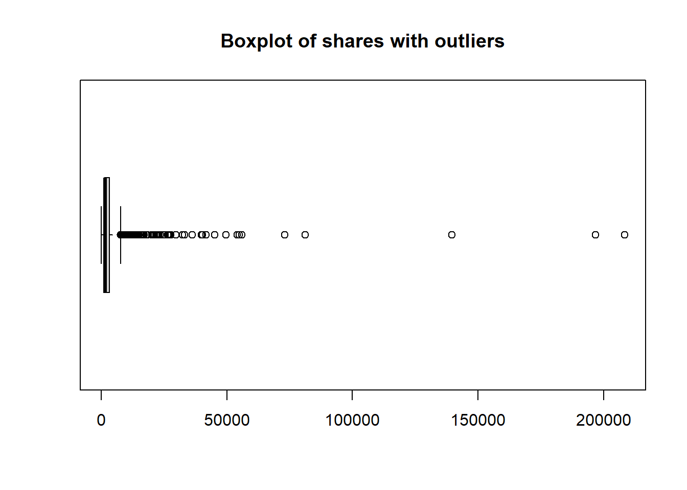<!-- -->

```r
boxplot(training_data$shares,horizontal = TRUE, range = 2, outline = FALSE,main = "Boxplot of shares without outliers")
```

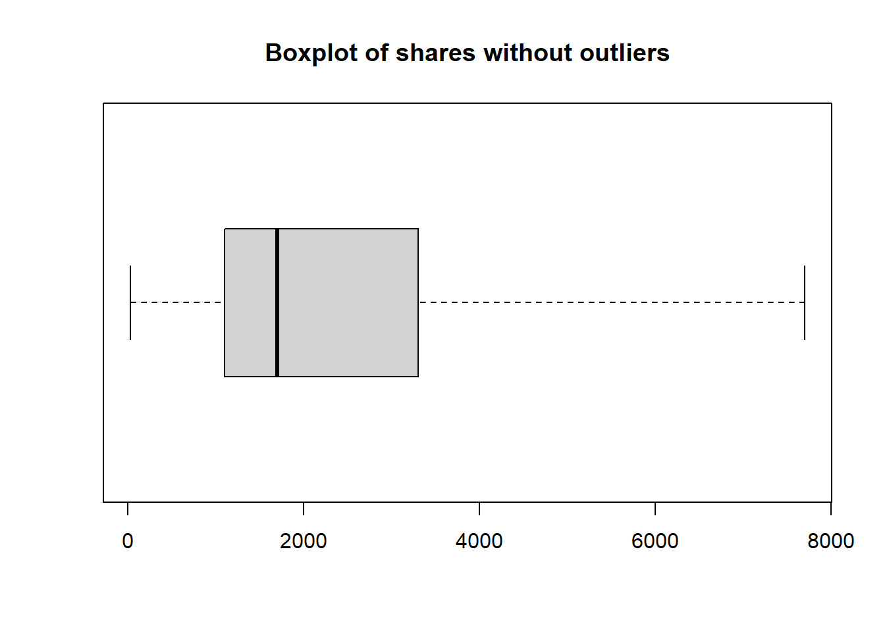<!-- -->

```r
# Creates a subset of training data without outliers for #plotting purposes
IQR <- quantile(training_data$shares)[4] - quantile(subset_data$shares)[2]
upper_limit <- quantile(training_data$shares)[4] + (1.5 * IQR)
lower_limit <- quantile(training_data$shares)[2] - (1.5 * IQR)
subset_data_wo_outliers <- training_data %>% filter(shares <= upper_limit & shares >= lower_limit)
```

After we remove any potential outliers to our data our we can compare shares our key metrics.

```r
correlation1 <- cor(subset_data_wo_outliers$shares,subset_data_wo_outliers$kw_avg_avg)

plot1 <- ggplot(subset_data_wo_outliers, aes(y= shares,x = kw_avg_avg)) + 
  geom_point() +
  geom_smooth() +
  labs(title = "Number of shares vs. Average number of key words", y= "# of shares", x = "Average # of key words") +
  geom_text(color = "red",x=15000,y=5000,label = paste0("Correlation = ",round(correlation1,3)))

plot1
```

```
## `geom_smooth()` using method = 'gam' and formula 'y ~ s(x, bs = "cs")'
```

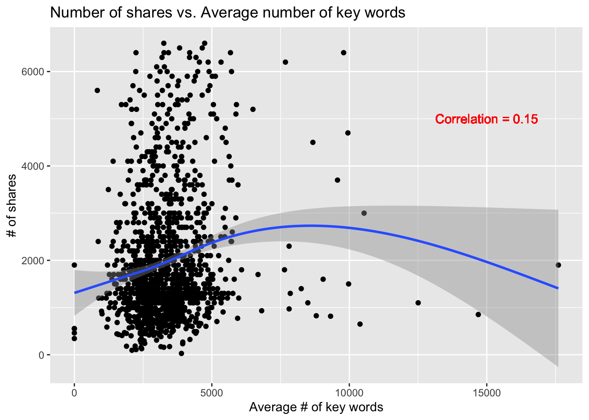<!-- -->

We can measure the trend of shares as a function of Average number of key words. If we see a possitive trend we can say that the more key words in the articles the more likely it is to be shared, the opposite can also be said. We measure the correlation to get a more precise gauge in case the graph is not clear enough.

```r
correlation2 <- cor(subset_data_wo_outliers$shares,subset_data_wo_outliers$average_token_length)

plot2 <- ggplot(subset_data_wo_outliers, aes(y= shares,x = average_token_length)) +
geom_density_2d() + 
  labs(title = "number of shares vs. Average length of words in content", y= "# of shares", x = "Average length of words in content") +
  geom_text(color = "red",x=5,y=3500,label = paste0("Correlation = ",round(correlation2,3)))

plot2
```

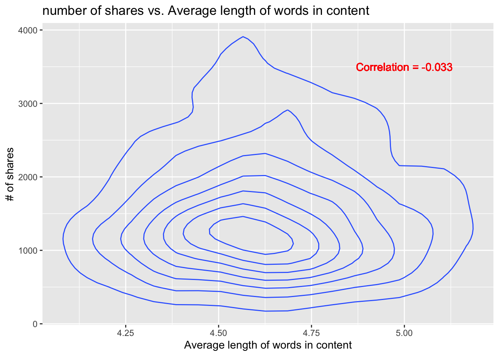<!-- -->

With a density plot as a function of average length of words in content we see where most of our shares come from. We can utilize this to help explain our model down below.


```r
correlation3 <- cor(subset_data_wo_outliers$shares,subset_data_wo_outliers$n_tokens_content)

plot3 <- ggplot(subset_data_wo_outliers, aes(y= shares,x = n_tokens_content)) +
geom_rug() +
  labs(title = "number of shares vs. number of words in content", y= "# of shares", x = "# of words in content") +
  geom_text(color = "red",x=4000,y=4000,label = paste0("Correlation = ",round(correlation3,3)))

plot3
```

<!-- -->

Using a rug graph we can measure the relationship between number of words in content and the number of shares. The intersection between where both rugs are highly concentrated is where how we can measure correlation. If both rugs are concentrated near zero than we see that the less words the more shareable the articles are or vice versa.


```r
correlation4 <- cor(subset_data_wo_outliers$shares,subset_data_wo_outliers$n_tokens_title)

plot4 <- ggplot(subset_data_wo_outliers, aes(y= shares,x = n_tokens_title)) +
geom_col() +
  labs(title = "number of shares vs. number of words in title", y= "# of shares", x = "# of words in title") +
  geom_text(color = "red",x=15,y=600000,label = paste0("Correlation = ",round(correlation4,3)))

plot4
```

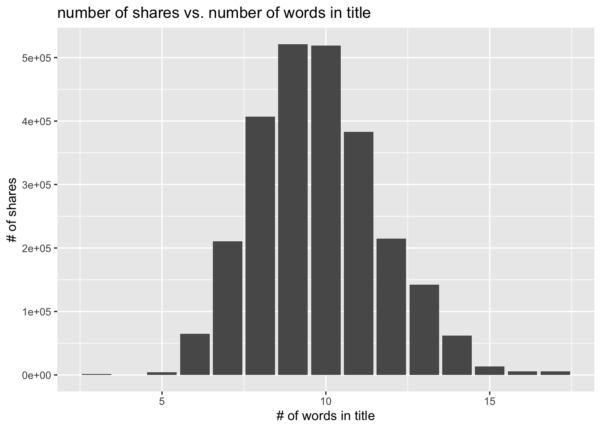<!-- -->
We see how the `# of words in title` as distributed with respect to number of shares. Any large skewness would be a flag for us to research further.


Here we graphically depict the correlations among the variables in the training data.

```r
# Note need to probably name graphs still etc...work in progress
corrplot(cor(training_data), tl.col = "black")
```

<!-- -->

In addition to the previous correlation plot, it is necessary to look at individual scatterplots of the shares vs. predictors. Previously, we plotted the relationship between shares and various word counts, but in this section we will focus exclusively on the emotion predictors such as `global_subjectivity`, `global_sentiment_polarity`,
`global_rate_negative_words`, `avg_negative_polarity`, `abs_title_subjectivity`, and `abs_title_sentiment_polarity`.

```r
corNoOut<- function(x) {
  var1 <- get(x, subset_data_wo_outliers)
  title <-paste0("Scatterplot of shares vs ", x)
  xlabel <- x
  g <- ggplot(subset_data_wo_outliers, aes(x = var1, y = shares)) + geom_point() +
    geom_smooth() + geom_smooth(method = lm, col = "Red") +
    labs(title = title, y= "# of shares", x = xlabel)
}
sentiment_preds <- list("global_subjectivity", "global_sentiment_polarity",
"global_rate_negative_words", "avg_negative_polarity",
"abs_title_subjectivity", "abs_title_sentiment_polarity")
lapply(sentiment_preds, corNoOut)
```

```
## [[1]]
```

```
## `geom_smooth()` using method = 'gam' and formula 'y ~ s(x, bs = "cs")'
```

```
## `geom_smooth()` using formula 'y ~ x'
```

<!-- -->

```
## 
## [[2]]
```

```
## `geom_smooth()` using method = 'gam' and formula 'y ~ s(x, bs = "cs")'
## `geom_smooth()` using formula 'y ~ x'
```

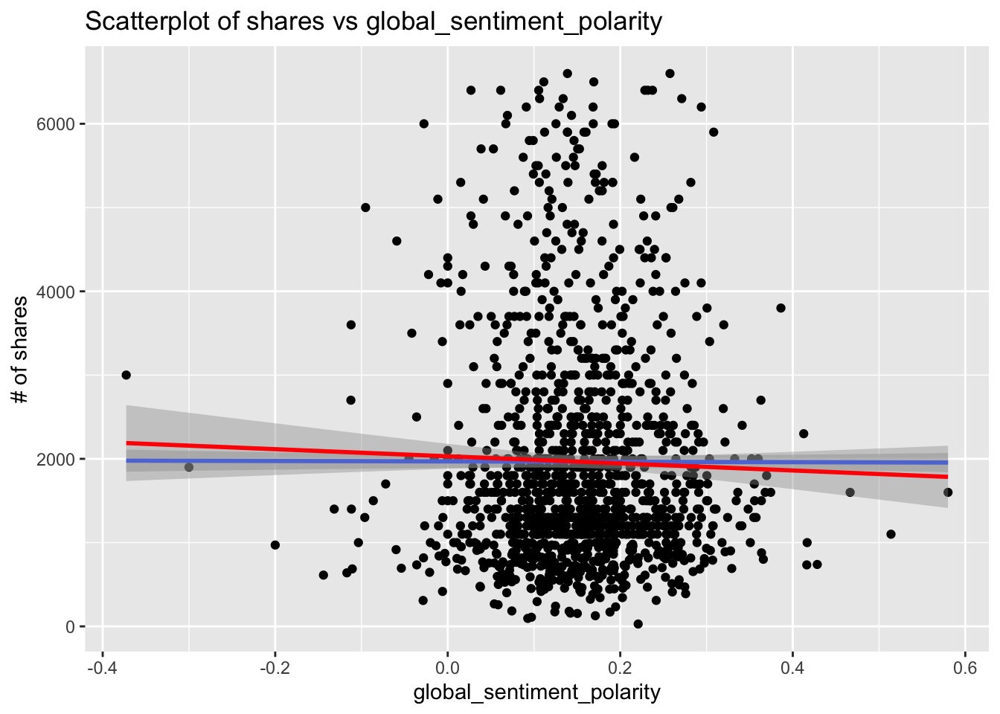<!-- -->

```
## 
## [[3]]
```

```
## `geom_smooth()` using method = 'gam' and formula 'y ~ s(x, bs = "cs")'
## `geom_smooth()` using formula 'y ~ x'
```

<!-- -->

```
## 
## [[4]]
```

```
## `geom_smooth()` using method = 'gam' and formula 'y ~ s(x, bs = "cs")'
## `geom_smooth()` using formula 'y ~ x'
```

<!-- -->

```
## 
## [[5]]
```

```
## `geom_smooth()` using method = 'gam' and formula 'y ~ s(x, bs = "cs")'
## `geom_smooth()` using formula 'y ~ x'
```

<!-- -->

```
## 
## [[6]]
```

```
## `geom_smooth()` using method = 'gam' and formula 'y ~ s(x, bs = "cs")'
## `geom_smooth()` using formula 'y ~ x'
```

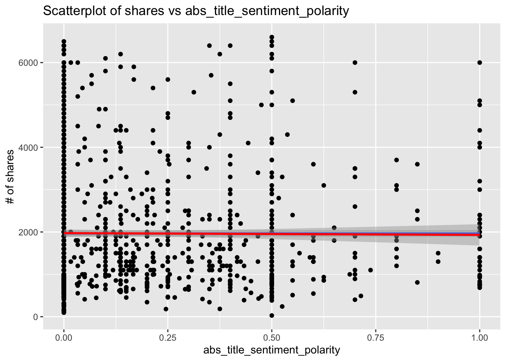<!-- -->


We also believe that shares might increase based on whether the post was created on a weekend. Perhaps, weekend posts are shared more frequently as, generally, people have more screen time and thus are more apt to share article. This section `shares` has been scaled and density plotted by `is_weekend` as a factor where 0 is a weekday and 1 is a weekend day.

```r
# Removing scientific notation for readability
options(scipen = 999)

# Coverts is_weekend into a two level factor
weekend_factor <- subset_data_wo_outliers %>%
  mutate(weekend = as.factor(is_weekend)) %>% select(weekend, shares)

# Base plot
g <- ggplot(weekend_factor, aes(x=shares)) +  xlab("Number of Shares") +
  ylab("Density")

# Filled, stacked histogram with density of shares by weekend level
g + geom_histogram(aes(y = ..density.., fill = weekend)) + 
  geom_density(adjust = 0.25, alpha = 0.5, aes(fill = weekend), position = "stack") +
  labs(title = "Density of Shares: Weekday vs. Weekend") + 
  scale_fill_discrete(name = "Weekday or Weekend?", labels = c("Weekday", "Weekend"))
```

```
## `stat_bin()` using `bins = 30`. Pick better value with `binwidth`.
```

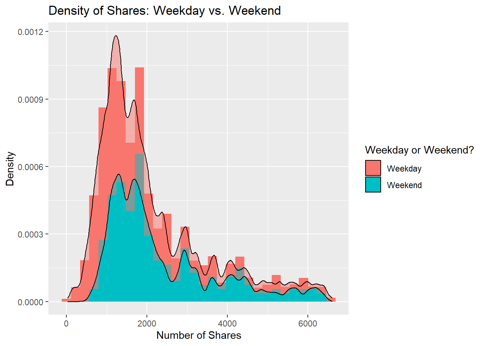<!-- -->

```r
# Turning on scientific notation
options(scipen = 0)
```

# Modeling

## Linear Models

Fitting our linear model with our chosen variables. 
In this first linear model we will investigate our suposition that readability of the title and content increase shares.

```r
# First linear model
lmfit1 <- lm(shares ~kw_avg_avg*average_token_length*n_tokens_content*n_tokens_title, data = training_data)
summary(lmfit1)
```

```
## 
## Call:
## lm(formula = shares ~ kw_avg_avg * average_token_length * n_tokens_content * 
##     n_tokens_title, data = training_data)
## 
## Residuals:
##    Min     1Q Median     3Q    Max 
## -12473  -2654  -1698   -282 202954 
## 
## Coefficients:
##                                                                   Estimate
## (Intercept)                                                     -6.425e+03
## kw_avg_avg                                                       2.692e+00
## average_token_length                                             1.336e+03
## n_tokens_content                                                -3.775e+01
## n_tokens_title                                                   1.113e+02
## kw_avg_avg:average_token_length                                 -4.243e-01
## kw_avg_avg:n_tokens_content                                      3.328e-03
## average_token_length:n_tokens_content                            8.218e+00
## kw_avg_avg:n_tokens_title                                        2.661e-02
## average_token_length:n_tokens_title                             -1.542e+01
## n_tokens_content:n_tokens_title                                  3.157e+00
## kw_avg_avg:average_token_length:n_tokens_content                -6.139e-04
## kw_avg_avg:average_token_length:n_tokens_title                  -7.446e-03
## kw_avg_avg:n_tokens_content:n_tokens_title                      -5.289e-04
## average_token_length:n_tokens_content:n_tokens_title            -6.262e-01
## kw_avg_avg:average_token_length:n_tokens_content:n_tokens_title  1.011e-04
##                                                                 Std. Error
## (Intercept)                                                      4.385e+04
## kw_avg_avg                                                       1.048e+01
## average_token_length                                             9.222e+03
## n_tokens_content                                                 1.172e+02
## n_tokens_title                                                   4.443e+03
## kw_avg_avg:average_token_length                                  2.194e+00
## kw_avg_avg:n_tokens_content                                      3.169e-02
## average_token_length:n_tokens_content                            2.591e+01
## kw_avg_avg:n_tokens_title                                        1.065e+00
## average_token_length:n_tokens_title                              9.317e+02
## n_tokens_content:n_tokens_title                                  1.171e+01
## kw_avg_avg:average_token_length:n_tokens_content                 7.044e-03
## kw_avg_avg:average_token_length:n_tokens_title                   2.217e-01
## kw_avg_avg:n_tokens_content:n_tokens_title                       3.133e-03
## average_token_length:n_tokens_content:n_tokens_title             2.582e+00
## kw_avg_avg:average_token_length:n_tokens_content:n_tokens_title  6.934e-04
##                                                                 t value
## (Intercept)                                                      -0.147
## kw_avg_avg                                                        0.257
## average_token_length                                              0.145
## n_tokens_content                                                 -0.322
## n_tokens_title                                                    0.025
## kw_avg_avg:average_token_length                                  -0.193
## kw_avg_avg:n_tokens_content                                       0.105
## average_token_length:n_tokens_content                             0.317
## kw_avg_avg:n_tokens_title                                         0.025
## average_token_length:n_tokens_title                              -0.017
## n_tokens_content:n_tokens_title                                   0.270
## kw_avg_avg:average_token_length:n_tokens_content                 -0.087
## kw_avg_avg:average_token_length:n_tokens_title                   -0.034
## kw_avg_avg:n_tokens_content:n_tokens_title                       -0.169
## average_token_length:n_tokens_content:n_tokens_title             -0.243
## kw_avg_avg:average_token_length:n_tokens_content:n_tokens_title   0.146
##                                                                 Pr(>|t|)
## (Intercept)                                                        0.884
## kw_avg_avg                                                         0.797
## average_token_length                                               0.885
## n_tokens_content                                                   0.747
## n_tokens_title                                                     0.980
## kw_avg_avg:average_token_length                                    0.847
## kw_avg_avg:n_tokens_content                                        0.916
## average_token_length:n_tokens_content                              0.751
## kw_avg_avg:n_tokens_title                                          0.980
## average_token_length:n_tokens_title                                0.987
## n_tokens_content:n_tokens_title                                    0.788
## kw_avg_avg:average_token_length:n_tokens_content                   0.931
## kw_avg_avg:average_token_length:n_tokens_title                     0.973
## kw_avg_avg:n_tokens_content:n_tokens_title                         0.866
## average_token_length:n_tokens_content:n_tokens_title               0.808
## kw_avg_avg:average_token_length:n_tokens_content:n_tokens_title    0.884
## 
## Residual standard error: 10070 on 1453 degrees of freedom
## Multiple R-squared:  0.02301,	Adjusted R-squared:  0.01292 
## F-statistic: 2.281 on 15 and 1453 DF,  p-value: 0.003433
```

Using the `data_source_is_lifestyle` as base data source, the following chunk of code was run and to determine potential significant additive and interaction terms by t tests for significance with p-values less than or equal to 0.05. The subsequent model was selected for this report:
`lm(shares ~  n_tokens_content*num_imgs + n_tokens_content*num_videos + 
                n_tokens_content:average_token_length + n_tokens_content*kw_avg_avg + 
                n_tokens_content*global_sentiment_polarity + 
                n_tokens_content*global_rate_negative_words + num_imgs*kw_avg_avg + 
                num_imgs*abs_title_sentiment_polarity + num_videos*average_token_length + 
                num_videos*global_subjectivity + num_videos*global_sentiment_polarity + 
                num_videos*global_rate_negative_words + num_videos*abs_title_sentiment_polarity,
              data = training_data)`

```r
# Generates a linear model with all main effects and interactions terms
lm_full <- lm(shares ~ .^2, data = training_data)
summary(lm_full)
```

This is the second linear model we will use as described above it was selected by examining p-values from the summary of the a linear model with all main effects and interaction terms.

```r
# Generalates second linear model candidate
lmfit2 <- lm(shares ~  n_tokens_content*num_imgs + n_tokens_content*num_videos + 
                n_tokens_content:average_token_length + n_tokens_content*kw_avg_avg + 
                n_tokens_content*global_sentiment_polarity + 
                n_tokens_content*global_rate_negative_words + num_imgs*kw_avg_avg + 
                num_imgs*abs_title_sentiment_polarity + num_videos*average_token_length + 
                num_videos*global_subjectivity + num_videos*global_sentiment_polarity + 
                num_videos*global_rate_negative_words + num_videos*abs_title_sentiment_polarity,
              data = training_data)
summary(lmfit2)
```

```
## 
## Call:
## lm(formula = shares ~ n_tokens_content * num_imgs + n_tokens_content * 
##     num_videos + n_tokens_content:average_token_length + n_tokens_content * 
##     kw_avg_avg + n_tokens_content * global_sentiment_polarity + 
##     n_tokens_content * global_rate_negative_words + num_imgs * 
##     kw_avg_avg + num_imgs * abs_title_sentiment_polarity + num_videos * 
##     average_token_length + num_videos * global_subjectivity + 
##     num_videos * global_sentiment_polarity + num_videos * global_rate_negative_words + 
##     num_videos * abs_title_sentiment_polarity, data = training_data)
## 
## Residuals:
##    Min     1Q Median     3Q    Max 
## -22635  -2592  -1379    251 201208 
## 
## Coefficients:
##                                               Estimate Std. Error t value
## (Intercept)                                  9.610e+03  2.916e+03   3.296
## n_tokens_content                            -2.220e+01  8.546e+00  -2.598
## num_imgs                                    -2.135e+02  1.287e+02  -1.659
## num_videos                                  -7.651e+03  2.215e+03  -3.454
## kw_avg_avg                                   3.880e-01  3.550e-01   1.093
## global_sentiment_polarity                   -2.762e+04  6.229e+03  -4.435
## global_rate_negative_words                  -1.908e+05  5.988e+04  -3.187
## abs_title_sentiment_polarity                 1.692e+03  1.362e+03   1.242
## average_token_length                        -7.899e+02  6.836e+02  -1.155
## global_subjectivity                          4.363e+03  3.751e+03   1.163
## n_tokens_content:num_imgs                   -4.161e-02  1.615e-02  -2.577
## n_tokens_content:num_videos                  1.516e+00  3.577e-01   4.238
## n_tokens_content:average_token_length        2.836e+00  1.741e+00   1.629
## n_tokens_content:kw_avg_avg                 -6.446e-04  4.798e-04  -1.344
## n_tokens_content:global_sentiment_polarity   4.646e+01  1.059e+01   4.388
## n_tokens_content:global_rate_negative_words  3.702e+02  1.020e+02   3.629
## num_imgs:kw_avg_avg                          7.130e-02  2.994e-02   2.382
## num_imgs:abs_title_sentiment_polarity       -1.861e+02  1.367e+02  -1.362
## num_videos:average_token_length              1.313e+03  4.765e+02   2.755
## num_videos:global_subjectivity              -6.089e+03  3.044e+03  -2.000
## num_videos:global_sentiment_polarity         1.550e+04  3.110e+03   4.985
## num_videos:global_rate_negative_words        1.358e+05  3.078e+04   4.414
## num_videos:abs_title_sentiment_polarity     -3.079e+03  6.552e+02  -4.699
##                                             Pr(>|t|)    
## (Intercept)                                 0.001004 ** 
## n_tokens_content                            0.009485 ** 
## num_imgs                                    0.097352 .  
## num_videos                                  0.000569 ***
## kw_avg_avg                                  0.274568    
## global_sentiment_polarity                   9.92e-06 ***
## global_rate_negative_words                  0.001471 ** 
## abs_title_sentiment_polarity                0.214515    
## average_token_length                        0.248117    
## global_subjectivity                         0.244995    
## n_tokens_content:num_imgs                   0.010058 *  
## n_tokens_content:num_videos                 2.39e-05 ***
## n_tokens_content:average_token_length       0.103431    
## n_tokens_content:kw_avg_avg                 0.179315    
## n_tokens_content:global_sentiment_polarity  1.23e-05 ***
## n_tokens_content:global_rate_negative_words 0.000294 ***
## num_imgs:kw_avg_avg                         0.017364 *  
## num_imgs:abs_title_sentiment_polarity       0.173528    
## num_videos:average_token_length             0.005945 ** 
## num_videos:global_subjectivity              0.045688 *  
## num_videos:global_sentiment_polarity        6.96e-07 ***
## num_videos:global_rate_negative_words       1.09e-05 ***
## num_videos:abs_title_sentiment_polarity     2.87e-06 ***
## ---
## Signif. codes:  0 '***' 0.001 '**' 0.01 '*' 0.05 '.' 0.1 ' ' 1
## 
## Residual standard error: 9767 on 1446 degrees of freedom
## Multiple R-squared:  0.0854,	Adjusted R-squared:  0.07148 
## F-statistic: 6.137 on 22 and 1446 DF,  p-value: < 2.2e-16
```

With a simple linear model we can test it's goodness of fit with $R^2$. Since we are measuring human behavior we can be comfortable with a low $R^2$. However too low (although subjective) would indicate that our hypothesis is wrong. As a rule of thumb we will say:


$$R^2 < .1 : we \space suspect \space that \space we \space cannot \space reject \space H_0 \\
  R^2 \space between \space .1 \space and \space .5 \space : \space we \space suspect \space that \space we \space would \space reject \space H_0 \space \\
  R^2 > .5 \space we \space feel \space confident \space that \space our \space variables \space are \space good \space predictors \space and \space our \space hypothesis \space is \space a \space good \space explanation.$$

## Ensemble Methods

### Random Forest
We can now fit our model above into a tree function. This will give us a better picture of where our variables are most important in our model.

```r
fitTree <- tree(shares ~kw_avg_avg + average_token_length + n_tokens_content + n_tokens_title, data = training_data)
plot(fitTree)
text(fitTree)
```

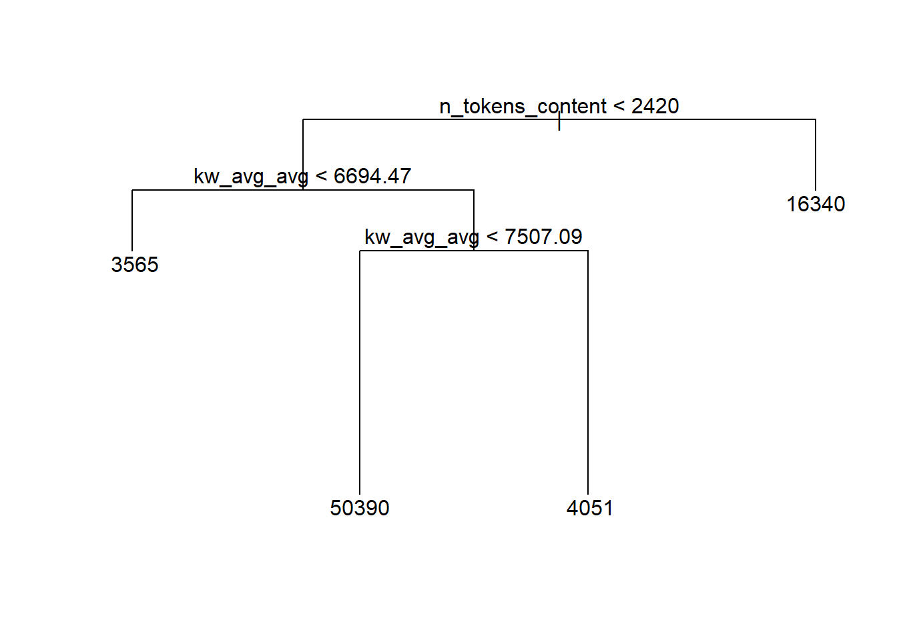<!-- -->

We are able to use the tree function to see where our variables are most important and in what order. This could change based on subject.

We can kick off a random forest model in our to see if adding this level of complexity for our model is needed/beneficial.

```r
#Random Forest
#Train control options for ensemble models
trCtrl <- trainControl(method = "repeatedcv", number = 5, repeats = 3)

rfFit <- train(shares ~kw_avg_avg + average_token_length + n_tokens_content + n_tokens_title, data = training_data, method = "rf",trControl=trCtrl, preProcess = c("center", "scale"),tuneGrid = data.frame(mtry = 1:4))

plot(rfFit)
```

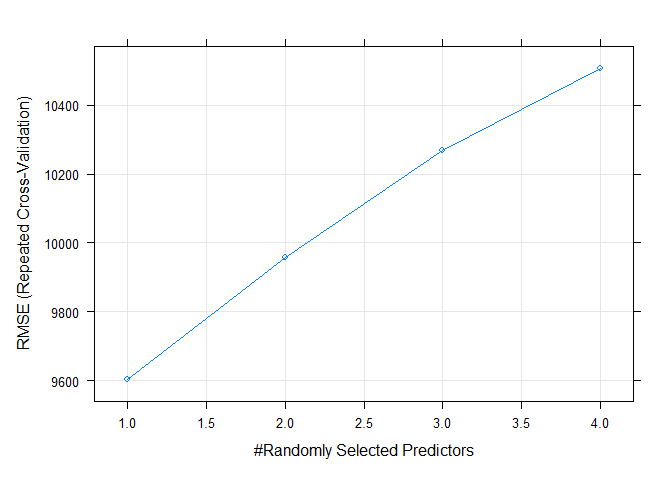<!-- -->

By plotting the `rfFit` we can see which `mtry` value is the best. This might be different between subjects.


### Boosted Tree
Lastly, a boosted tree was fit using 5-fold, 3 times repeated cross-validation with tuning parameter combinations of `n.trees` = (10, 25, 50, 100, 150, and 200), `interaction.depth` = 1:4, `shrinkage` = 0.1, and `n.minobsinnode` = 10.

```r
#Tune Parameters for cross-validation
tuneParam <-expand.grid(n.trees = c(10, 25, 50, 100, 150, 200),
                         interaction.depth = 1:4, shrinkage = 0.1,
                         n.minobsinnode = 10)
#Cross-validation, tune parameter selection, and training of boosted tree models
boostTree <-train(shares ~ ., data = training_data, method = "gbm",
                trControl = trCtrl, preProcess = c("center","scale"),
                tuneGrid = tuneParam)
```

Here are results of the cross-validation for selecting the best model.

```r
#Plot of RMSE by Max Tree Depth
plot(boostTree)
```

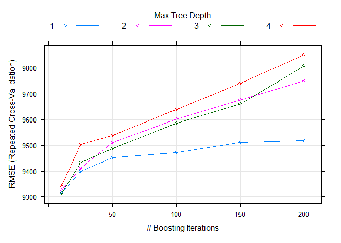<!-- -->

```r
#Results from model training
boostTree$results
```

<div data-pagedtable="false">
  <script data-pagedtable-source type="application/json">
{"columns":[{"label":[""],"name":["_rn_"],"type":[""],"align":["left"]},{"label":["shrinkage"],"name":[1],"type":["dbl"],"align":["right"]},{"label":["interaction.depth"],"name":[2],"type":["int"],"align":["right"]},{"label":["n.minobsinnode"],"name":[3],"type":["dbl"],"align":["right"]},{"label":["n.trees"],"name":[4],"type":["dbl"],"align":["right"]},{"label":["RMSE"],"name":[5],"type":["dbl"],"align":["right"]},{"label":["Rsquared"],"name":[6],"type":["dbl"],"align":["right"]},{"label":["MAE"],"name":[7],"type":["dbl"],"align":["right"]},{"label":["RMSESD"],"name":[8],"type":["dbl"],"align":["right"]},{"label":["RsquaredSD"],"name":[9],"type":["dbl"],"align":["right"]},{"label":["MAESD"],"name":[10],"type":["dbl"],"align":["right"]}],"data":[{"1":"0.1","2":"1","3":"10","4":"10","5":"9314.184","6":"0.006675399","7":"3574.866","8":"4221.399","9":"0.01108386","10":"434.2246","_rn_":"1"},{"1":"0.1","2":"2","3":"10","4":"10","5":"9326.250","6":"0.008708143","7":"3597.577","8":"4217.418","9":"0.01272067","10":"432.9358","_rn_":"7"},{"1":"0.1","2":"3","3":"10","4":"10","5":"9313.307","6":"0.013211804","7":"3591.647","8":"4197.678","9":"0.01881223","10":"443.8152","_rn_":"13"},{"1":"0.1","2":"4","3":"10","4":"10","5":"9341.809","6":"0.008903508","7":"3585.682","8":"4176.453","9":"0.01011317","10":"404.1564","_rn_":"19"},{"1":"0.1","2":"1","3":"10","4":"25","5":"9399.601","6":"0.007283239","7":"3588.176","8":"4158.064","9":"0.01004078","10":"437.2697","_rn_":"2"},{"1":"0.1","2":"2","3":"10","4":"25","5":"9410.613","6":"0.011630621","7":"3607.004","8":"4152.264","9":"0.01602844","10":"424.2763","_rn_":"8"},{"1":"0.1","2":"3","3":"10","4":"25","5":"9432.370","6":"0.017201038","7":"3641.356","8":"4085.304","9":"0.02181729","10":"429.1372","_rn_":"14"},{"1":"0.1","2":"4","3":"10","4":"25","5":"9502.518","6":"0.010234358","7":"3657.953","8":"4082.510","9":"0.01145599","10":"422.6376","_rn_":"20"},{"1":"0.1","2":"1","3":"10","4":"50","5":"9451.768","6":"0.009962417","7":"3616.140","8":"4126.123","9":"0.01383672","10":"447.9844","_rn_":"3"},{"1":"0.1","2":"2","3":"10","4":"50","5":"9511.982","6":"0.011574672","7":"3675.049","8":"4093.038","9":"0.01431167","10":"428.1359","_rn_":"9"},{"1":"0.1","2":"3","3":"10","4":"50","5":"9488.373","6":"0.018698245","7":"3688.605","8":"4033.984","9":"0.02130345","10":"423.5607","_rn_":"15"},{"1":"0.1","2":"4","3":"10","4":"50","5":"9539.500","6":"0.013203120","7":"3703.391","8":"4072.646","9":"0.01592706","10":"440.9838","_rn_":"21"},{"1":"0.1","2":"1","3":"10","4":"100","5":"9472.570","6":"0.010399059","7":"3624.979","8":"4137.664","9":"0.01434483","10":"449.5649","_rn_":"4"},{"1":"0.1","2":"2","3":"10","4":"100","5":"9601.471","6":"0.011599459","7":"3725.661","8":"4066.493","9":"0.01390977","10":"428.0979","_rn_":"10"},{"1":"0.1","2":"3","3":"10","4":"100","5":"9584.944","6":"0.016464760","7":"3735.526","8":"3966.046","9":"0.01702471","10":"381.7412","_rn_":"16"},{"1":"0.1","2":"4","3":"10","4":"100","5":"9638.625","6":"0.012982475","7":"3837.131","8":"4008.699","9":"0.01262629","10":"445.7811","_rn_":"22"},{"1":"0.1","2":"1","3":"10","4":"150","5":"9511.486","6":"0.010188450","7":"3642.995","8":"4129.512","9":"0.01327370","10":"437.8190","_rn_":"5"},{"1":"0.1","2":"2","3":"10","4":"150","5":"9675.794","6":"0.009764527","7":"3776.819","8":"4111.983","9":"0.01206035","10":"461.2173","_rn_":"11"},{"1":"0.1","2":"3","3":"10","4":"150","5":"9660.395","6":"0.017377519","7":"3814.385","8":"3949.451","9":"0.01868900","10":"394.6577","_rn_":"17"},{"1":"0.1","2":"4","3":"10","4":"150","5":"9741.684","6":"0.013249400","7":"3934.740","8":"3930.264","9":"0.01214062","10":"387.2624","_rn_":"23"},{"1":"0.1","2":"1","3":"10","4":"200","5":"9519.644","6":"0.009792193","7":"3648.228","8":"4134.406","9":"0.01296948","10":"439.7082","_rn_":"6"},{"1":"0.1","2":"2","3":"10","4":"200","5":"9749.786","6":"0.008528765","7":"3831.016","8":"4081.354","9":"0.01011915","10":"467.9957","_rn_":"12"},{"1":"0.1","2":"3","3":"10","4":"200","5":"9808.359","6":"0.016024585","7":"3922.796","8":"3926.611","9":"0.01745069","10":"396.7291","_rn_":"18"},{"1":"0.1","2":"4","3":"10","4":"200","5":"9850.543","6":"0.012967079","7":"4039.521","8":"3951.242","9":"0.01186421","10":"433.6684","_rn_":"24"}],"options":{"columns":{"min":{},"max":[10]},"rows":{"min":[10],"max":[10]},"pages":{}}}
  </script>
</div>

The best tuning paramters are:

```r
#Best tuning parameters
boostTree$bestTune
```

<div data-pagedtable="false">
  <script data-pagedtable-source type="application/json">
{"columns":[{"label":[""],"name":["_rn_"],"type":[""],"align":["left"]},{"label":["n.trees"],"name":[1],"type":["dbl"],"align":["right"]},{"label":["interaction.depth"],"name":[2],"type":["int"],"align":["right"]},{"label":["shrinkage"],"name":[3],"type":["dbl"],"align":["right"]},{"label":["n.minobsinnode"],"name":[4],"type":["dbl"],"align":["right"]}],"data":[{"1":"10","2":"3","3":"0.1","4":"10","_rn_":"13"}],"options":{"columns":{"min":{},"max":[10]},"rows":{"min":[10],"max":[10]},"pages":{}}}
  </script>
</div>

This section generates the predictions based on the best boosted tree model. 

```r
#Uses best tuned training boosted tree model to predict test data
boostTreePred <-predict(boostTree, newdata = test_data)

#Reports best boosted tree model and corresponding RMSE
boost <-boostTree$results[1,]
boost
```

<div data-pagedtable="false">
  <script data-pagedtable-source type="application/json">
{"columns":[{"label":[""],"name":["_rn_"],"type":[""],"align":["left"]},{"label":["shrinkage"],"name":[1],"type":["dbl"],"align":["right"]},{"label":["interaction.depth"],"name":[2],"type":["int"],"align":["right"]},{"label":["n.minobsinnode"],"name":[3],"type":["dbl"],"align":["right"]},{"label":["n.trees"],"name":[4],"type":["dbl"],"align":["right"]},{"label":["RMSE"],"name":[5],"type":["dbl"],"align":["right"]},{"label":["Rsquared"],"name":[6],"type":["dbl"],"align":["right"]},{"label":["MAE"],"name":[7],"type":["dbl"],"align":["right"]},{"label":["RMSESD"],"name":[8],"type":["dbl"],"align":["right"]},{"label":["RsquaredSD"],"name":[9],"type":["dbl"],"align":["right"]},{"label":["MAESD"],"name":[10],"type":["dbl"],"align":["right"]}],"data":[{"1":"0.1","2":"1","3":"10","4":"10","5":"9314.184","6":"0.006675399","7":"3574.866","8":"4221.399","9":"0.01108386","10":"434.2246","_rn_":"1"}],"options":{"columns":{"min":{},"max":[10]},"rows":{"min":[10],"max":[10]},"pages":{}}}
  </script>
</div>

# Comparison


```r
lmfit_1 = c(MAE(test_data$shares,predict(lmfit1)),RMSE(test_data$shares,predict(lmfit1)))

lmfit_2 = c(MAE(test_data$shares,predict(lmfit2)),RMSE(test_data$shares,predict(lmfit2)))

rffit_c = c(MAE(test_data$shares,predict(rfFit)),RMSE(test_data$shares,predict(rfFit)))

boostTree_c = c(MAE(test_data$shares,predict(boostTree)),RMSE(test_data$shares,predict(boostTree)))

MAE_RMSE_SUMM <- rbind.data.frame("Linear Model 1" = lmfit_1, "Linear Model 2" = lmfit_2,"Random Forrest" = rffit_c, "Boosted Tree" = boostTree_c)

colnames(MAE_RMSE_SUMM) <- c("MAE","RMSE")
rownames(MAE_RMSE_SUMM) <- c("Linear Model 1", "Linear Model 2", "Random Forrest", "Boosted Tree")
kable(MAE_RMSE_SUMM, caption = "Comparing models via MAE and RMSE")
```


Table: Comparing models via MAE and RMSE

|               |      MAE|     RMSE|
|:--------------|--------:|--------:|
|Linear Model 1 | 3110.422| 4986.746|
|Linear Model 2 | 3363.329| 5594.405|
|Random Forrest | 3340.404| 6673.423|
|Boosted Tree   | 3094.707| 4983.017|

Measuring success with MAE and RMSE. This helps measure the models success while also accounting for the complexity of the model. We can use the MAE **and** RMSE to see if any issues in our data come form a single point (or a small subset of points).

# Automation

The following code chunk was called in the console in order to generate a report of each category of data_channel_is_* (`lifestyle`, `entertainment`, `bus`, `socmed`, `tech`, `world`).

```r
library(rmarkdown)
# Creates a list of the six data_channel_is_* options
category <- c("lifestyle", "entertainment", "bus", "socmed", "tech", "world")

# Creates output filenames
output_file <- paste0(category, ".html")
# Creates a list for each data channel with just the category parameter
params = lapply(category, FUN = function(x){list(category = x)})

# Stores list of file output file names and parameters as a data frame
reports <- tibble(output_file, params)

# Applies the render function to each pair of output file name and category
apply(reports, MARGIN = 1, FUN = function(x){ render(input = "Project 2.Rmd",
                                                     output_file = x[[1]],
                                                     params = x[[2]])})
```
